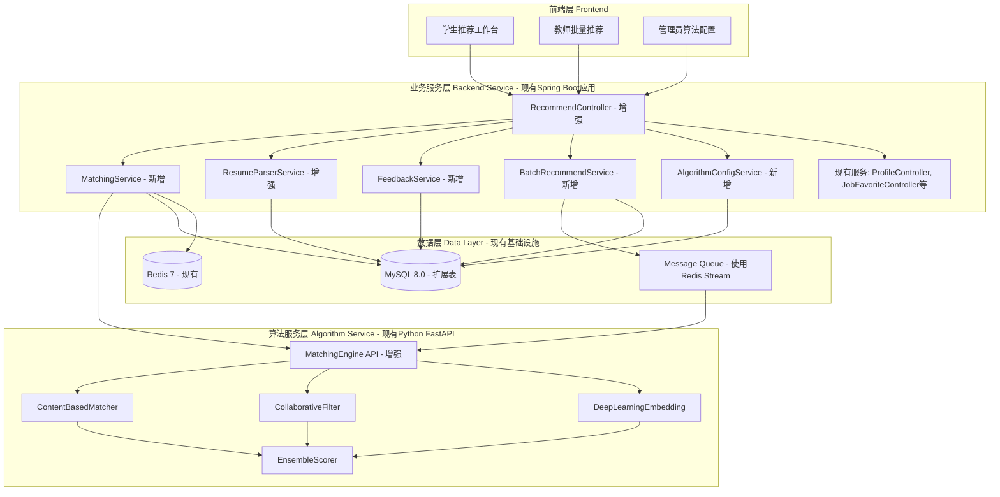

# Design Document: Intelligent Job Matching Enhancement

## Overview

本设计文档定义了智能岗位匹配增强功能的技术实现方案。**该功能在现有Spring Boot + MyBatis Plus架构基础上进行增量开发**,通过引入多维度匹配引擎、简历智能解析、个性化推荐学习和AI职业顾问等核心能力,深度优化学生、教师和管理员三种用户角色的体验,使岗位推荐功能真正发挥价值。

### 增量开发策略

**复用现有实现**:
- ✅ 现有表: sys_user, user_profile(扩展字段), biz_job_posting, biz_job_favorite, biz_company, biz_career_path, dim_*维度表
- ✅ 现有服务: RecommendController(增强), AiFileImportService(增强), ProfileController, JobFavoriteController
- ✅ 现有基础设施: Spring Security认证, RedisTemplate, AsyncConfig, SchedulerConfig, Algorithm Service(Python FastAPI)

**新增内容**:
- 🔧 扩展现有表: biz_recommendation_result(维度分数+解释), biz_job_favorite(交互类型+权重), user_profile(智能匹配+简历解析字段)
- ♻️ 复用现有表: biz_analysis_task(批量推荐任务管理)
- 🆕 5个新服务: MatchingService, FeedbackService, BatchRecommendService, AlgorithmConfigService, 增强ResumeParserService
- 💾 算法配置: 使用Redis存储(algorithm:config:active),无需新建表

### 设计目标

1. **精准匹配**: 基于6+维度的智能匹配算法,提供Match_Score 60+的高质量推荐
2. **可解释性**: 为每个推荐提供详细的Match_Explanation,增强用户信任
3. **自动化**: 通过Resume_Parser自动构建Student_Profile,降低用户输入成本
4. **个性化**: 通过Feedback_Loop持续学习用户偏好,动态优化推荐结果
5. **高性能**: 支持批量推荐(100学生/5分钟)、实时匹配(500ms响应)和大规模并发
6. **可扩展**: 算法服务与业务服务解耦,支持独立升级和水平扩展

### 技术约束

- **现有技术栈**: Spring Boot 2.7.18 + MyBatis Plus 3.5.5 + MySQL 8.0 + Redis 7
- **Java版本**: JDK 1.8
- **不重建项目**: 在现有代码库基础上增量开发,复用现有认证、配置、工具类
- **兼容性**: 保持与现有模块(AI助手、数据分析、报告生成)的接口兼容

---

## Architecture

### 系统架构图

**架构原则**: 在现有Spring Boot 2.7.18 + MyBatis Plus 3.5.5架构基础上增量开发,复用现有基础设施。



### 架构分层说明

#### 1. 前端层 (Frontend Layer)
- **学生推荐工作台**: 卡片式推荐展示、多维筛选、实时匹配度预览
- **教师批量推荐**: 批量学生选择、异步任务进度、Excel导出
- **管理员算法配置**: 权重调整、A/B测试、效果监控

#### 2. 业务服务层 (Backend Service Layer)
**集成方式**: 在现有Spring Boot应用中新增Service和增强Controller

**现有组件复用**:
- Spring Security认证授权
- RedisTemplate缓存操作
- AsyncConfig异步任务框架
- SchedulerConfig定时任务框架
- 统一异常处理和日志记录

**新增/增强组件**:
- **RecommendController (增强)**: 在现有推荐API基础上,新增缓存、反馈、批量接口
- **MatchingService (新增)**: 核心匹配服务,调用算法引擎并缓存结果
- **ResumeParserService (增强)**: 扩展现有AiFileImportService,增加历史记录和准确性评分
- **FeedbackService (新增)**: 用户反馈收集与偏好学习
- **BatchRecommendService (新增)**: 批量推荐任务管理与异步处理
- **AlgorithmConfigService (新增)**: 算法配置管理与版本控制

#### 3. 算法服务层 (Algorithm Service Layer)
**集成方式**: 增强现有Python FastAPI算法服务,新增匹配引擎API

**现有服务**: 已部署的Algorithm Service (Python FastAPI)
**新增功能**: 
- MatchingEngine API: 多维度匹配计算
- 多模型融合: ContentBased + Collaborative + DeepLearning
- 批量推荐接口

#### 4. 数据层 (Data Layer)
**现有基础设施复用**:
- **MySQL 8.0**: 扩展现有表(user_profile, biz_recommendation_result, biz_job_favorite),复用biz_analysis_task
- **Redis 7**: 使用现有RedisTemplate,新增推荐缓存Key + 算法配置存储
- **Message Queue**: 使用Redis Stream实现异步任务队列

### 服务间通信

| 通信路径 | 协议 | 说明 |
|---------|------|------|
| Frontend → Backend | HTTP/REST | 标准RESTful API,JWT认证 |
| Backend → Algorithm | HTTP/REST | 同步调用(实时推荐)、异步MQ(批量任务) |
| Backend → MySQL | JDBC | MyBatis Plus ORM |
| Backend → Redis | Redis Protocol | Spring Data Redis |
| Backend → MQ | AMQP/Redis Stream | 异步任务分发 |

### 容错与降级策略

1. **算法服务熔断**: 当Algorithm Service不可用时,Backend Service降级到基于规则的简单匹配
2. **缓存优先**: 优先返回Redis缓存的预计算结果,缓存未命中时实时计算
3. **超时控制**: Algorithm Service调用设置5秒超时,超时后返回降级结果
4. **限流保护**: 使用Guava RateLimiter对实时匹配请求限流,防止算法服务过载

---

## Components and Interfaces

### 核心组件设计

本节明确标注**新增服务**和**增强现有服务**,避免重复开发。

#### 1. MatchingService (匹配服务) - **新增服务**

**职责**: 协调匹配流程,管理缓存,调用算法服务

**与现有系统的关系**: 
- 现有RecommendController已有基础推荐功能,但缺少缓存、反馈学习、批量处理
- 此服务封装核心匹配逻辑,供Controller调用

**关键方法**:
```java
public interface MatchingService {
    /**
     * 为学生生成个性化推荐
     * @param studentId 学生ID
     * @param limit 推荐数量
     * @return 推荐岗位列表(含匹配分数和解释)
     */
    List<JobRecommendation> getRecommendations(Long studentId, Integer limit);
    
    /**
     * 计算学生与岗位的匹配度
     * @param studentId 学生ID
     * @param jobId 岗位ID
     * @return 匹配结果(分数+解释)
     */
    MatchResult calculateMatch(Long studentId, Long jobId);
    
    /**
     * 预计算推荐(定时任务调用)
     * @param studentIds 学生ID列表
     */
    void preComputeRecommendations(List<Long> studentIds);
    
    /**
     * 实时更新匹配度(学生编辑画像时调用)
     * @param studentId 学生ID
     * @param favoriteJobIds 收藏的岗位ID列表
     * @return 更新后的匹配分数
     */
    Map<Long, MatchScoreChange> updateMatchScores(Long studentId, List<Long> favoriteJobIds);
}
```

**实现要点**:
- 优先从Redis读取预计算结果(Key: `recommend:student:{studentId}`, TTL: 24h)
- 缓存未命中时调用Algorithm Service实时计算
- 使用Circuit Breaker模式处理算法服务故障
- 记录所有匹配请求日志用于后续分析

#### 2. ResumeParserService (简历解析服务) - **增强现有服务**

**职责**: 解析简历文件,提取结构化信息,构建学生画像

**与现有系统的关系**:
- 现有AiFileImportService已有简历解析功能
- 此服务增强功能:添加解析历史记录、准确性评分、技能标准化映射

**关键方法**:
```java
public interface ResumeParserService {
    /**
     * 解析简历文件
     * @param file 简历文件(PDF/DOCX/TXT)
     * @param studentId 学生ID
     * @return 解析结果
     */
    ResumeParseResult parseResume(MultipartFile file, Long studentId);
    
    /**
     * 提取技能关键词
     * @param text 文本内容
     * @return 标准化技能列表
     */
    List<String> extractSkills(String text);
    
    /**
     * 映射技能到标准分类
     * @param rawSkills 原始技能列表
     * @return 标准化技能分类
     */
    List<SkillCategory> mapToTaxonomy(List<String> rawSkills);
    
    /**
     * 验证解析准确性
     * @param parseResult 解析结果
     * @return 准确性评分(0-100)
     */
    Integer validateAccuracy(ResumeParseResult parseResult);
}
```

**技术选型**:
- **PDF解析**: Apache PDFBox (已在pom.xml中)
- **DOCX解析**: Apache POI (已在pom.xml中)
- **NLP技能提取**: 调用Algorithm Service的NER接口
- **技能分类**: 基于预定义的技能分类树(存储在MySQL dim_skill表)

#### 3. FeedbackService (反馈学习服务) - **新增服务**

**职责**: 收集用户交互反馈,更新偏好权重,触发模型重训练

**与现有系统的关系**:
- 现有JobFavoriteController只记录收藏操作
- 此服务扩展到所有交互类型(查看、申请、忽略),并实现偏好学习

**关键方法**:
```java
public interface FeedbackService {
    /**
     * 记录用户交互
     * @param interaction 交互事件
     */
    void recordInteraction(UserInteraction interaction);
    
    /**
     * 更新学生偏好权重
     * @param studentId 学生ID
     */
    void updatePreferenceWeights(Long studentId);
    
    /**
     * 获取学生交互历史
     * @param studentId 学生ID
     * @param days 最近天数
     * @return 交互记录列表
     */
    List<UserInteraction> getInteractionHistory(Long studentId, Integer days);
    
    /**
     * 触发模型重训练
     * @param studentIds 学生ID列表(null表示全量)
     */
    void triggerModelRetrain(List<Long> studentIds);
}
```

**交互权重定义**:
```java
public enum InteractionType {
    VIEW(1),      // 查看详情
    FAVORITE(3),  // 收藏
    APPLY(5),     // 申请
    DISMISS(-2);  // 不感兴趣
    
    private final int weight;
}
```

#### 4. BatchRecommendService (批量推荐服务) - **新增服务**

**职责**: 处理教师批量推荐请求,管理异步任务,生成汇总报告

**与现有系统的关系**:
- 现有RecommendController不支持批量推荐
- 此服务新增批量处理能力,使用现有AsyncConfig异步框架

**关键方法**:
```java
public interface BatchRecommendService {
    /**
     * 创建批量推荐任务
     * @param teacherId 教师ID
     * @param studentIds 学生ID列表
     * @param limit 每个学生的推荐数量
     * @return 任务ID
     */
    String createBatchTask(Long teacherId, List<Long> studentIds, Integer limit);
    
    /**
     * 查询任务进度
     * @param taskId 任务ID
     * @return 任务状态
     */
    BatchTaskStatus getTaskStatus(String taskId);
    
    /**
     * 导出推荐结果到Excel
     * @param taskId 任务ID
     * @return Excel文件流
     */
    ByteArrayOutputStream exportToExcel(String taskId);
    
    /**
     * 发送推荐邮件给学生
     * @param taskId 任务ID
     */
    void sendEmailNotifications(String taskId);
}
```

**异步处理流程**:
1. 创建任务记录(状态: PENDING)
2. 将任务ID推送到Redis Stream消息队列
3. 后台Worker消费任务,逐个学生生成推荐
4. 更新任务进度(已完成数/总数)
5. 任务完成后更新状态为COMPLETED,生成汇总报告

#### 5. AlgorithmConfigService (算法配置服务) - **新增服务**

**职责**: 管理匹配算法配置,支持A/B测试,版本控制

**与现有系统的关系**:
- 现有系统无算法配置管理功能
- 此服务新增动态配置能力,支持管理员调整匹配权重

**关键方法**:
```java
public interface AlgorithmConfigService {
    /**
     * 获取当前激活的配置
     * @return 算法配置
     */
    AlgorithmConfig getActiveConfig();
    
    /**
     * 创建新配置版本
     * @param config 配置内容
     * @return 配置ID
     */
    Long createConfig(AlgorithmConfig config);
    
    /**
     * 激活指定配置
     * @param configId 配置ID
     */
    void activateConfig(Long configId);
    
    /**
     * 创建A/B测试
     * @param configIdA 配置A
     * @param configIdB 配置B
     * @param trafficSplit 流量分配比例(0-100)
     * @return 测试ID
     */
    String createABTest(Long configIdA, Long configIdB, Integer trafficSplit);
    
    /**
     * 获取A/B测试结果
     * @param testId 测试ID
     * @return 对比指标
     */
    ABTestResult getABTestResult(String testId);
}
```

**配置内容示例**:
```json
{
  "version": "v2.1",
  "dimensionWeights": {
    "skills": 30,
    "education": 15,
    "experience": 20,
    "location": 10,
    "salary": 15,
    "industry": 10
  },
  "minMatchScore": 60,
  "ensembleWeights": {
    "contentBased": 0.4,
    "collaborative": 0.3,
    "deepLearning": 0.3
  },
  "diversityPenalty": 0.6
}
```

### 算法服务API接口

#### Algorithm Service REST API

**Base URL**: `http://algorithm:8000/api/v1`

**1. 计算匹配分数**
```http
POST /matching/calculate
Content-Type: application/json

{
  "studentProfile": {
    "skills": ["Java", "Spring Boot", "MySQL"],
    "education": "本科",
    "graduationYear": 2025,
    "experience": 0,
    "locationPreference": "北京",
    "salaryExpectation": [8000, 15000],
    "industryInterest": ["互联网", "金融科技"]
  },
  "jobPosting": {
    "id": 12345,
    "title": "Java后端开发工程师",
    "skills": ["Java", "Spring", "Redis", "MySQL"],
    "education": "本科",
    "experience": "0-2年",
    "location": "北京",
    "salary": [10000, 18000],
    "industry": "互联网"
  },
  "config": {
    "dimensionWeights": {...}
  }
}

Response:
{
  "matchScore": 82.5,
  "dimensionScores": {
    "skills": 85,
    "education": 100,
    "experience": 90,
    "location": 100,
    "salary": 75,
    "industry": 100
  },
  "explanation": {
    "strengths": [
      "您掌握的Java和MySQL技能与岗位要求高度匹配",
      "学历要求完全符合"
    ],
    "gaps": [
      "建议学习Redis以提升匹配度"
    ]
  }
}
```

**2. 批量推荐**
```http
POST /matching/batch
Content-Type: application/json

{
  "studentIds": [101, 102, 103],
  "limit": 20,
  "config": {...}
}

Response:
{
  "taskId": "batch_20250128_001",
  "status": "processing",
  "estimatedTime": 120
}
```

**3. 简历解析**
```http
POST /resume/parse
Content-Type: multipart/form-data

file: <resume.pdf>

Response:
{
  "personalInfo": {
    "name": "张三",
    "phone": "138****1234",
    "email": "zhang***@example.com"
  },
  "education": [
    {
      "school": "北京大学",
      "major": "计算机科学与技术",
      "degree": "本科",
      "graduationYear": 2025
    }
  ],
  "skills": ["Java", "Python", "MySQL", "Spring Boot"],
  "experience": [],
  "accuracy": 92
}
```

---

## Data Models

### 数据库表设计

**设计原则**: 通过扩展现有表来实现所有功能,不创建新表。复用现有的biz_recommendation_result、biz_job_favorite、user_profile、biz_analysis_task等表。

#### 1. 扩展现有表: biz_recommendation_result

**说明**: 现有表已包含基础推荐字段(user_id, job_posting_id, match_score, match_reason, rank_no, is_viewed, created_at)。扩展以支持多维度匹配和详细解释。

```sql
-- 新增字段
ALTER TABLE biz_recommendation_result ADD COLUMN IF NOT EXISTS dimension_scores JSON COMMENT '各维度分数 {skills:85, education:100, ...}';
ALTER TABLE biz_recommendation_result ADD COLUMN IF NOT EXISTS explanation JSON COMMENT '详细匹配解释 {strengths:[], gaps:[]}';
ALTER TABLE biz_recommendation_result ADD COLUMN IF NOT EXISTS config_version VARCHAR(50) COMMENT '使用的配置版本';
ALTER TABLE biz_recommendation_result ADD COLUMN IF NOT EXISTS algorithm_version VARCHAR(50) COMMENT '算法版本';
ALTER TABLE biz_recommendation_result ADD COLUMN IF NOT EXISTS calculation_time_ms INT COMMENT '计算耗时(毫秒)';
```

**Java Entity扩展**:
```java
// 在现有RecommendationResult类中新增以下字段
@TableField(typeHandler = JacksonTypeHandler.class)
private Map<String, Integer> dimensionScores;

@TableField(typeHandler = JacksonTypeHandler.class)
private MatchExplanation explanation;

private String configVersion;
private String algorithmVersion;
private Integer calculationTimeMs;
```

**用途**: 
- 记录每次匹配计算的详细结果
- 支持可解释推荐(维度分数+详细解释)
- 用于分析和审计

#### 2. 扩展现有表: biz_job_favorite

**说明**: 现有表已包含收藏字段(user_id, job_id, note, created_at)。扩展以支持所有交互类型(查看、收藏、申请、忽略)。

```sql
-- 新增字段
ALTER TABLE biz_job_favorite ADD COLUMN IF NOT EXISTS interaction_type VARCHAR(20) DEFAULT 'FAVORITE' COMMENT '交互类型: VIEW/FAVORITE/APPLY/DISMISS';
ALTER TABLE biz_job_favorite ADD COLUMN IF NOT EXISTS interaction_weight INT DEFAULT 3 COMMENT '交互权重: VIEW=1, FAVORITE=3, APPLY=5, DISMISS=-2';
ALTER TABLE biz_job_favorite ADD COLUMN IF NOT EXISTS match_score DECIMAL(5,2) COMMENT '当时的匹配分数';

-- 修改唯一索引以支持多次交互
ALTER TABLE biz_job_favorite DROP INDEX IF EXISTS uk_user_job;
ALTER TABLE biz_job_favorite ADD INDEX idx_user_job_type (user_id, job_id, interaction_type);
```

**Java Entity扩展**:
```java
// 在现有JobFavorite类中新增以下字段
private String interactionType; // VIEW/FAVORITE/APPLY/DISMISS
private Integer interactionWeight;
private BigDecimal matchScore;
```

**用途**:
- 记录用户对推荐结果的所有交互行为
- 用于反馈学习和偏好权重更新
- 支持个性化推荐优化

#### 3. 扩展现有表: user_profile

**说明**: 现有user_profile表已包含基础字段(userId, majorId, educationLevel, targetCityCode, expectedSalaryMin/Max, skills等)。扩展以支持智能匹配和简历解析。

```sql
-- 新增字段(智能匹配相关)
ALTER TABLE user_profile ADD COLUMN IF NOT EXISTS graduation_year INT COMMENT '毕业年份';
ALTER TABLE user_profile ADD COLUMN IF NOT EXISTS work_experience INT DEFAULT 0 COMMENT '工作经验(年)';
ALTER TABLE user_profile ADD COLUMN IF NOT EXISTS industry_interest JSON COMMENT '感兴趣的行业列表';
ALTER TABLE user_profile ADD COLUMN IF NOT EXISTS profile_completeness INT DEFAULT 0 COMMENT '画像完整度(0-100)';
ALTER TABLE user_profile ADD COLUMN IF NOT EXISTS preference_weights JSON COMMENT '个性化偏好权重 {skills:30, education:15, ...}';

-- 新增字段(简历解析相关)
ALTER TABLE user_profile ADD COLUMN IF NOT EXISTS resume_file_name VARCHAR(255) COMMENT '最近上传的简历文件名';
ALTER TABLE user_profile ADD COLUMN IF NOT EXISTS resume_parse_status VARCHAR(20) COMMENT '简历解析状态: SUCCESS/FAILED/PENDING';
ALTER TABLE user_profile ADD COLUMN IF NOT EXISTS resume_parse_data JSON COMMENT '简历解析提取的数据';
ALTER TABLE user_profile ADD COLUMN IF NOT EXISTS resume_accuracy_score INT COMMENT '简历解析准确性评分(0-100)';
ALTER TABLE user_profile ADD COLUMN IF NOT EXISTS resume_parsed_at DATETIME COMMENT '简历解析时间';
```

**Java Entity扩展**:
```java
// 在现有UserProfile类中新增以下字段

// 智能匹配相关
private Integer graduationYear;
private Integer workExperience;

@TableField(typeHandler = JacksonTypeHandler.class)
private List<String> industryInterest;

private Integer profileCompleteness;

@TableField(typeHandler = JacksonTypeHandler.class)
private Map<String, Double> preferenceWeights;

// 简历解析相关
private String resumeFileName;
private String resumeParseStatus;

@TableField(typeHandler = JacksonTypeHandler.class)
private ResumeParseData resumeParseData;

private Integer resumeAccuracyScore;
private LocalDateTime resumeParsedAt;
```

**用途**:
- 支持多维度智能匹配
- 记录个性化偏好学习结果
- 存储简历解析历史和结果
- 追踪画像完整度

#### 4. 复用现有表: biz_analysis_task

**说明**: 现有表已包含任务管理字段(task_name, task_type, status, result_data, created_by, created_at, started_at, completed_at)。直接复用以支持批量推荐任务。

**无需修改表结构**,通过task_type区分任务类型:

```java
// 批量推荐任务使用示例
AnalysisTask task = new AnalysisTask();
task.setTaskName("批量推荐-" + teacherName);
task.setTaskType("BATCH_RECOMMEND"); // 新增任务类型
task.setStatus("PENDING");
task.setCreatedBy(teacherId);

// result_data存储批量推荐结果
Map<String, Object> resultData = new HashMap<>();
resultData.put("studentCount", 100);
resultData.put("completedCount", 45);
resultData.put("recommendations", recommendationList);
task.setResultData(JSON.toJSONString(resultData));
```

**用途**:
- 管理教师批量推荐任务
- 追踪任务状态和进度
- 存储批量推荐结果汇总

#### 5. 算法配置管理方案

**说明**: 算法配置不需要专门的表,可以通过以下方式管理:

**方案A: Redis存储(推荐)**
```java
// 存储当前激活配置
redisTemplate.opsForValue().set("algorithm:config:active", configJson);

// 存储配置历史版本
redisTemplate.opsForHash().put("algorithm:config:versions", version, configJson);

// 配置示例
{
  "version": "v2.1",
  "dimensionWeights": {
    "skills": 30,
    "education": 15,
    "experience": 20,
    "location": 10,
    "salary": 15,
    "industry": 10
  },
  "minMatchScore": 60,
  "ensembleWeights": {
    "contentBased": 0.4,
    "collaborative": 0.3,
    "deepLearning": 0.3
  },
  "diversityPenalty": 0.6
}
```

**方案B: 配置文件存储**
```yaml
# application-algorithm.yml
algorithm:
  matching:
    version: v2.1
    dimension-weights:
      skills: 30
      education: 15
      experience: 20
      location: 10
      salary: 15
      industry: 10
    min-match-score: 60
    ensemble-weights:
      content-based: 0.4
      collaborative: 0.3
      deep-learning: 0.3
    diversity-penalty: 0.6
```

**方案C: 扩展sys_user表(如果需要用户级配置)**
```sql
-- 为管理员用户添加算法配置字段
ALTER TABLE sys_user ADD COLUMN IF NOT EXISTS algorithm_config JSON COMMENT '算法配置(仅管理员)';
ALTER TABLE sys_user ADD COLUMN IF NOT EXISTS config_version VARCHAR(50) COMMENT '配置版本';
ALTER TABLE sys_user ADD COLUMN IF NOT EXISTS config_updated_at DATETIME COMMENT '配置更新时间';
```

**推荐使用方案A(Redis)**,原因:
- 配置变更频繁,Redis读写性能更好
- 支持配置版本管理和回滚
- 无需数据库迁移
- 配置变更实时生效(1分钟内)

### Redis缓存设计

#### 缓存Key规范

| Key Pattern | 说明 | TTL | 示例 |
|------------|------|-----|------|
| `recommend:student:{studentId}` | 学生推荐列表 | 24h | `recommend:student:1001` |
| `match:score:{studentId}:{jobId}` | 匹配分数 | 1h | `match:score:1001:5001` |
| `profile:completeness:{studentId}` | 画像完整度 | 1h | `profile:completeness:1001` |
| `config:active` | 当前激活配置 | 永久 | `config:active` |
| `batch:task:{taskId}` | 批量任务状态 | 7d | `batch:task:batch_20250128_001` |
| `feedback:recent:{studentId}` | 最近交互记录 | 7d | `feedback:recent:1001` |

#### 缓存数据结构

**推荐列表缓存**:
```json
{
  "studentId": 1001,
  "recommendations": [
    {
      "jobId": 5001,
      "matchScore": 85.5,
      "rank": 1,
      "explanation": {...}
    },
    ...
  ],
  "generatedAt": "2025-01-28T10:00:00Z",
  "configVersion": "v2.1"
}
```

**批量任务状态缓存**:
```json
{
  "taskId": "batch_20250128_001",
  "status": "PROCESSING",
  "progress": {
    "total": 100,
    "completed": 45,
    "percentage": 45
  },
  "startedAt": "2025-01-28T10:00:00Z"
}
```

---

## Correctness Properties

*A property is a characteristic or behavior that should hold true across all valid executions of a system-essentially, a formal statement about what the system should do. Properties serve as the bridge between human-readable specifications and machine-verifiable correctness guarantees.*

本功能涉及多个复杂的业务逻辑和外部服务集成,需要通过属性测试来验证核心不变量。以下是基于需求分析的可测试属性。

### 属性测试前置分析

在编写属性之前,我需要分析需求文档中的验收标准,判断哪些适合属性测试,哪些适合示例测试或集成测试。


### Property Reflection

在编写正确性属性之前,我需要审查prework中识别的所有可测试属性,消除冗余:

**识别的核心属性**:
1. 维度完整性 (1.1) - 验证所有6个维度都被计算
2. 维度归一化 (1.3) - 所有维度分数在[0,100]范围内
3. 加权求和 (1.4) - 最终分数等于加权和
4. 分数过滤 (1.6) - 推荐列表中所有岗位分数>=60
5. 降序排序 (1.7) - 推荐列表按分数降序排列
6. 权重配置验证 (11.2) - 权重总和必须等于100
7. 数据标准化 (19.1-19.3, 19.5-19.6) - 岗位数据标准化和验证
8. 推荐多样性 (22.1-22.3) - 行业多样性和公司分布约束

**冗余分析**:
- 属性1.1(维度完整性)和1.4(加权求和)可以合并:如果计算加权和,必然包含所有维度
- 属性19.1, 19.2, 19.3可以合并为一个通用的"数据标准化"属性
- 属性22.1, 22.2, 22.3可以合并为一个"推荐多样性"属性

**最终属性列表**(消除冗余后):
1. 匹配分数计算正确性 (合并1.1, 1.3, 1.4)
2. 推荐过滤和排序 (合并1.6, 1.7)
3. 配置权重验证 (11.2)
4. 岗位数据标准化 (合并19.1-19.3)
5. 岗位数据验证 (19.5-19.6)
6. 推荐多样性约束 (合并22.1-22.3)
7. 简历解析数据完整性 (3.2, 3.5)
8. 反馈记录完整性 (4.1)
9. 偏好重置幂等性 (4.7)

### Property 1: 匹配分数计算正确性

*For any* student profile and job posting, when calculating match score, the system SHALL:
- Compute scores for all 6 dimensions (skills, education, experience, location, salary, industry)
- Normalize each dimension score to [0, 100] range
- Return final match score as weighted sum: matchScore = Σ(dimensionScore[i] × weight[i] / 100)

**Validates: Requirements 1.1, 1.2, 1.3, 1.4**

### Property 2: 推荐过滤和排序

*For any* recommendation list generated for a student, the system SHALL:
- Filter out all jobs with matchScore < 60
- Sort remaining jobs in descending order by matchScore

**Validates: Requirements 1.6, 1.7**

### Property 3: 配置权重验证

*For any* algorithm configuration update, the system SHALL:
- Validate that the sum of all dimension weights equals 100
- Reject configurations where Σ(weights) ≠ 100

**Validates: Requirements 11.2**

### Property 4: 岗位数据标准化

*For any* job posting ingested into the system, the system SHALL:
- Normalize job title to standard taxonomy
- Standardize salary to [min, max] monthly range format
- Normalize location to province-city-district hierarchy

**Validates: Requirements 19.1, 19.2, 19.3**

### Property 5: 岗位数据验证

*For any* job posting submitted for ingestion, the system SHALL:
- Validate presence of all required fields (title, company, location, salary)
- Reject incomplete postings
- Identify and merge duplicate postings based on (title, company, location) tuple

**Validates: Requirements 19.5, 19.6**

### Property 6: 推荐多样性约束

*For any* recommendation list of 20+ jobs (when sufficient jobs exist), the system SHALL:
- Include jobs from at least 3 different industries
- Ensure no single company has more than 5 jobs in the list
- Include at least 20% of jobs from outside the student's preferred industry

**Validates: Requirements 22.1, 22.2, 22.3**

### Property 7: 简历解析数据完整性

*For any* successfully parsed resume, the system SHALL:
- Extract all required sections: personal info, education, skills
- Populate corresponding Student_Profile fields
- Mark auto-filled fields with appropriate metadata

**Validates: Requirements 3.2, 3.5**

### Property 8: 反馈记录完整性

*For any* user interaction (view, favorite, apply, dismiss), the system SHALL:
- Record the interaction with timestamp
- Assign correct weight based on interaction type
- Store student ID, job ID, and match score at time of interaction

**Validates: Requirements 4.1, 4.2**

### Property 9: 偏好重置幂等性

*For any* student profile with customized preference weights, when reset preferences is called, the system SHALL:
- Restore all dimension weights to default values
- Clear accumulated interaction history
- Calling reset multiple times SHALL produce the same result (idempotent)

**Validates: Requirements 4.7**

---

## Error Handling

### 错误分类与处理策略

#### 1. 业务逻辑错误

| 错误类型 | HTTP状态码 | 错误码 | 处理策略 |
|---------|-----------|--------|---------|
| 学生画像不存在 | 404 | PROFILE_NOT_FOUND | 返回错误信息,提示完善画像 |
| 岗位不存在 | 404 | JOB_NOT_FOUND | 返回错误信息 |
| 配置权重和不为100 | 400 | INVALID_WEIGHTS | 返回验证错误,说明正确格式 |
| 批量任务学生数超限 | 400 | BATCH_SIZE_EXCEEDED | 返回错误,说明最大支持100个学生 |
| 简历文件格式不支持 | 400 | UNSUPPORTED_FILE_FORMAT | 返回支持的格式列表 |
| 简历文件过大 | 413 | FILE_TOO_LARGE | 返回文件大小限制(10MB) |

#### 2. 外部服务错误

| 错误场景 | 处理策略 | 降级方案 |
|---------|---------|---------|
| Algorithm Service超时 | 5秒超时后触发熔断 | 使用基于规则的简单匹配 |
| Algorithm Service不可用 | Circuit Breaker打开 | 返回缓存的历史推荐 |
| Redis连接失败 | 记录日志,继续执行 | 直接查询MySQL,不使用缓存 |
| MySQL连接失败 | 返回503错误 | 无降级,服务不可用 |
| 简历解析服务失败 | 返回解析错误 | 提示用户手动填写 |

#### 3. 数据一致性错误

| 错误场景 | 检测方式 | 修复策略 |
|---------|---------|---------|
| 缓存与数据库不一致 | 定期校验任务 | 清除缓存,强制重新计算 |
| 匹配分数异常(>100或<0) | 计算后验证 | 记录错误日志,使用边界值 |
| 推荐列表为空 | 返回前检查 | 降低匹配阈值重新推荐 |
| 批量任务状态不一致 | 任务完成时校验 | 重新统计并更新状态 |

### 错误响应格式

统一使用现有的`Result`类返回错误:

```java
@Data
public class Result<T> {
    private Integer code;
    private String message;
    private T data;
    private Long timestamp;
    
    public static <T> Result<T> error(Integer code, String message) {
        Result<T> result = new Result<>();
        result.setCode(code);
        result.setMessage(message);
        result.setTimestamp(System.currentTimeMillis());
        return result;
    }
}
```

**错误码规范**:
- 1xxx: 匹配相关错误
- 2xxx: 简历解析相关错误
- 3xxx: 批量推荐相关错误
- 4xxx: 配置管理相关错误
- 5xxx: 系统级错误

### 日志记录策略

#### 日志级别使用

| 级别 | 使用场景 | 示例 |
|-----|---------|------|
| ERROR | 系统错误、外部服务失败 | "Algorithm service call failed: timeout after 5s" |
| WARN | 降级、数据异常 | "Using fallback matching due to algorithm service unavailable" |
| INFO | 关键业务操作 | "Generated 20 recommendations for student 1001 in 450ms" |
| DEBUG | 详细执行流程 | "Dimension scores: skills=85, education=100, ..." |

#### 关键操作日志

```java
// 匹配请求日志
log.info("Match request: studentId={}, jobId={}, configVersion={}", 
    studentId, jobId, configVersion);

// 匹配结果日志
log.info("Match result: studentId={}, jobId={}, score={}, time={}ms", 
    studentId, jobId, matchScore, calculationTime);

// 算法服务调用日志
log.info("Calling algorithm service: endpoint={}, payload={}", 
    endpoint, payload);

// 降级日志
log.warn("Algorithm service degraded, using fallback matching: reason={}", 
    reason);

// 批量任务日志
log.info("Batch task created: taskId={}, studentCount={}, teacherId={}", 
    taskId, studentCount, teacherId);
log.info("Batch task progress: taskId={}, completed={}/{}", 
    taskId, completed, total);
```

### 重试机制

#### 算法服务调用重试

```java
@Retryable(
    value = {RestClientException.class},
    maxAttempts = 3,
    backoff = @Backoff(delay = 1000, multiplier = 2)
)
public MatchResult callAlgorithmService(MatchRequest request) {
    // 调用算法服务
}
```

#### 批量任务失败重试

- 单个学生推荐失败不影响其他学生
- 失败的学生记录到错误列表
- 任务完成后提供失败学生列表供重试

---

## Testing Strategy

### 测试方法论

本功能采用**双轨测试策略**:
1. **单元测试**: 验证具体示例、边界条件和错误处理
2. **属性测试**: 验证跨所有输入的通用属性和不变量

两者互补,共同保证全面覆盖:
- 单元测试捕获具体场景的bug
- 属性测试验证通用正确性保证

### 属性测试配置

**测试框架**: JUnit 5 + jqwik (Java property-based testing library)

**添加依赖**:
```xml
<dependency>
    <groupId>net.jqwik</groupId>
    <artifactId>jqwik</artifactId>
    <version>1.8.2</version>
    <scope>test</scope>
</dependency>
```

**测试配置**:
- 每个属性测试最少运行100次迭代
- 使用`@Property`注解标记属性测试
- 使用`@Tag`注解关联设计文档属性

### 属性测试实现示例

#### Property 1: 匹配分数计算正确性

```java
@Property
@Tag("Feature: intelligent-job-matching-enhancement, Property 1: 匹配分数计算正确性")
void matchScoreCalculationCorrectness(
    @ForAll("studentProfiles") StudentProfile profile,
    @ForAll("jobPostings") JobPosting job,
    @ForAll("algorithmConfigs") AlgorithmConfig config
) {
    // When: 计算匹配分数
    MatchResult result = matchingService.calculateMatch(
        profile.getId(), job.getId(), config
    );
    
    // Then: 验证所有6个维度都被计算
    assertThat(result.getDimensionScores()).containsKeys(
        "skills", "education", "experience", 
        "location", "salary", "industry"
    );
    
    // Then: 验证所有维度分数在[0, 100]范围内
    result.getDimensionScores().values().forEach(score -> {
        assertThat(score).isBetween(0, 100);
    });
    
    // Then: 验证最终分数等于加权和
    double expectedScore = result.getDimensionScores().entrySet().stream()
        .mapToDouble(e -> e.getValue() * config.getWeight(e.getKey()) / 100.0)
        .sum();
    assertThat(result.getMatchScore())
        .isCloseTo(expectedScore, within(0.01));
}

@Provide
Arbitrary<StudentProfile> studentProfiles() {
    return Combinators.combine(
        Arbitraries.integers().between(1, 10000),
        Arbitraries.of("Java", "Python", "JavaScript", "C++").list().ofMinSize(1).ofMaxSize(10),
        Arbitraries.of("高中", "专科", "本科", "硕士", "博士"),
        Arbitraries.integers().between(2020, 2026),
        Arbitraries.integers().between(0, 10)
    ).as((id, skills, edu, year, exp) -> {
        StudentProfile profile = new StudentProfile();
        profile.setId((long) id);
        profile.setSkills(skills);
        profile.setEducationLevel(edu);
        profile.setGraduationYear(year);
        profile.setWorkExperience(exp);
        return profile;
    });
}
```

#### Property 2: 推荐过滤和排序

```java
@Property
@Tag("Feature: intelligent-job-matching-enhancement, Property 2: 推荐过滤和排序")
void recommendationFilteringAndSorting(
    @ForAll("studentProfiles") StudentProfile profile
) {
    // When: 获取推荐列表
    List<JobRecommendation> recommendations = 
        matchingService.getRecommendations(profile.getId(), 20);
    
    // Then: 所有推荐的匹配分数 >= 60
    recommendations.forEach(rec -> {
        assertThat(rec.getMatchScore()).isGreaterThanOrEqualTo(60.0);
    });
    
    // Then: 推荐列表按分数降序排列
    for (int i = 0; i < recommendations.size() - 1; i++) {
        assertThat(recommendations.get(i).getMatchScore())
            .isGreaterThanOrEqualTo(recommendations.get(i + 1).getMatchScore());
    }
}
```

#### Property 3: 配置权重验证

```java
@Property
@Tag("Feature: intelligent-job-matching-enhancement, Property 3: 配置权重验证")
void configWeightValidation(
    @ForAll("dimensionWeights") Map<String, Integer> weights
) {
    // Given: 创建配置
    AlgorithmConfig config = new AlgorithmConfig();
    config.setDimensionWeights(weights);
    
    // When: 保存配置
    int sum = weights.values().stream().mapToInt(Integer::intValue).sum();
    
    if (sum == 100) {
        // Then: 权重和为100时应该成功
        assertDoesNotThrow(() -> algorithmConfigService.createConfig(config));
    } else {
        // Then: 权重和不为100时应该抛出异常
        assertThrows(InvalidWeightsException.class, 
            () -> algorithmConfigService.createConfig(config));
    }
}

@Provide
Arbitrary<Map<String, Integer>> dimensionWeights() {
    return Arbitraries.integers().between(0, 100).list().ofSize(6)
        .map(weights -> {
            Map<String, Integer> map = new HashMap<>();
            String[] dimensions = {"skills", "education", "experience", 
                                   "location", "salary", "industry"};
            for (int i = 0; i < 6; i++) {
                map.put(dimensions[i], weights.get(i));
            }
            return map;
        });
}
```

#### Property 6: 推荐多样性约束

```java
@Property
@Tag("Feature: intelligent-job-matching-enhancement, Property 6: 推荐多样性约束")
void recommendationDiversityConstraints(
    @ForAll("studentProfiles") StudentProfile profile
) {
    // When: 获取20+推荐
    List<JobRecommendation> recommendations = 
        matchingService.getRecommendations(profile.getId(), 20);
    
    // Skip if insufficient jobs
    assumeTrue(recommendations.size() >= 20);
    
    // Then: 至少3个不同行业
    Set<String> industries = recommendations.stream()
        .map(JobRecommendation::getIndustry)
        .collect(Collectors.toSet());
    assertThat(industries).hasSizeGreaterThanOrEqualTo(3);
    
    // Then: 单个公司不超过5个岗位
    Map<String, Long> companyCount = recommendations.stream()
        .collect(Collectors.groupingBy(
            JobRecommendation::getCompany, 
            Collectors.counting()
        ));
    companyCount.values().forEach(count -> {
        assertThat(count).isLessThanOrEqualTo(5);
    });
    
    // Then: 至少20%来自非偏好行业
    String preferredIndustry = profile.getIndustryInterest().get(0);
    long outsidePreferred = recommendations.stream()
        .filter(rec -> !rec.getIndustry().equals(preferredIndustry))
        .count();
    assertThat(outsidePreferred).isGreaterThanOrEqualTo(4); // 20% of 20
}
```

### 单元测试策略

#### 测试覆盖目标

- **行覆盖率**: ≥ 80%
- **分支覆盖率**: ≥ 70%
- **关键路径覆盖**: 100%

#### 关键单元测试场景

**MatchingService测试**:
```java
@Test
void shouldReturnCachedRecommendationsWhenAvailable() {
    // Given: Redis中有缓存
    when(redisTemplate.opsForValue().get("recommend:student:1001"))
        .thenReturn(cachedRecommendations);
    
    // When: 请求推荐
    List<JobRecommendation> result = matchingService.getRecommendations(1001L, 20);
    
    // Then: 返回缓存结果,不调用算法服务
    assertThat(result).isEqualTo(cachedRecommendations);
    verify(algorithmClient, never()).calculateMatch(any());
}

@Test
void shouldFallbackToRuleBasedMatchingWhenAlgorithmServiceFails() {
    // Given: 算法服务不可用
    when(algorithmClient.calculateMatch(any()))
        .thenThrow(new RestClientException("Service unavailable"));
    
    // When: 请求推荐
    List<JobRecommendation> result = matchingService.getRecommendations(1001L, 20);
    
    // Then: 使用降级匹配,返回结果
    assertThat(result).isNotEmpty();
    assertThat(result.get(0).getExplanation())
        .contains("基于规则的简单匹配");
}
```

**ResumeParserService测试**:
```java
@Test
void shouldParsePDFResumeSuccessfully() throws Exception {
    // Given: PDF简历文件
    MockMultipartFile file = new MockMultipartFile(
        "resume", "test.pdf", "application/pdf", pdfContent
    );
    
    // When: 解析简历
    ResumeParseResult result = resumeParserService.parseResume(file, 1001L);
    
    // Then: 提取关键字段
    assertThat(result.getStatus()).isEqualTo("SUCCESS");
    assertThat(result.getExtractedData().getEducation()).isNotEmpty();
    assertThat(result.getExtractedData().getSkills()).isNotEmpty();
}

@Test
void shouldHandleUnsupportedFileFormat() {
    // Given: 不支持的文件格式
    MockMultipartFile file = new MockMultipartFile(
        "resume", "test.doc", "application/msword", docContent
    );
    
    // When & Then: 抛出异常
    assertThrows(UnsupportedFileFormatException.class, 
        () -> resumeParserService.parseResume(file, 1001L));
}
```

**BatchRecommendService测试**:
```java
@Test
void shouldCreateBatchTaskAndReturnTaskId() {
    // Given: 教师和学生列表
    Long teacherId = 2001L;
    List<Long> studentIds = Arrays.asList(1001L, 1002L, 1003L);
    
    // When: 创建批量任务
    String taskId = batchRecommendService.createBatchTask(teacherId, studentIds, 20);
    
    // Then: 返回任务ID,任务状态为PENDING
    assertThat(taskId).isNotNull();
    BatchTaskStatus status = batchRecommendService.getTaskStatus(taskId);
    assertThat(status.getStatus()).isEqualTo("PENDING");
    assertThat(status.getStudentCount()).isEqualTo(3);
}

@Test
void shouldRejectBatchTaskExceeding100Students() {
    // Given: 超过100个学生
    List<Long> studentIds = LongStream.range(1, 102).boxed().collect(Collectors.toList());
    
    // When & Then: 抛出异常
    assertThrows(BatchSizeExceededException.class, 
        () -> batchRecommendService.createBatchTask(2001L, studentIds, 20));
}
```

### 集成测试策略

#### 测试环境

- **数据库**: 使用Testcontainers启动MySQL容器
- **Redis**: 使用Testcontainers启动Redis容器
- **算法服务**: 使用WireMock模拟HTTP响应

#### 关键集成测试场景

```java
@SpringBootTest
@Testcontainers
class MatchingIntegrationTest {
    
    @Container
    static MySQLContainer<?> mysql = new MySQLContainer<>("mysql:8.0");
    
    @Container
    static GenericContainer<?> redis = new GenericContainer<>("redis:7")
        .withExposedPorts(6379);
    
    @Test
    void shouldGenerateRecommendationsEndToEnd() {
        // Given: 完整的学生画像和岗位数据
        StudentProfile profile = createCompleteProfile();
        List<JobPosting> jobs = createJobPostings(50);
        
        // When: 请求推荐
        List<JobRecommendation> recommendations = 
            matchingService.getRecommendations(profile.getId(), 20);
        
        // Then: 返回高质量推荐
        assertThat(recommendations).hasSize(20);
        assertThat(recommendations.get(0).getMatchScore()).isGreaterThan(80);
        
        // Then: 推荐被缓存
        String cacheKey = "recommend:student:" + profile.getId();
        assertThat(redisTemplate.hasKey(cacheKey)).isTrue();
    }
    
    @Test
    void shouldHandleAlgorithmServiceTimeout() {
        // Given: 算法服务响应超时
        wireMockServer.stubFor(post("/api/v1/matching/calculate")
            .willReturn(aResponse().withFixedDelay(6000)));
        
        // When: 请求推荐
        List<JobRecommendation> recommendations = 
            matchingService.getRecommendations(1001L, 20);
        
        // Then: 使用降级方案,仍返回结果
        assertThat(recommendations).isNotEmpty();
    }
}
```

### 性能测试

#### 性能目标

| 操作 | 目标响应时间 | 并发量 |
|------|------------|--------|
| 单次匹配计算 | < 500ms (P95) | 100 QPS |
| 获取推荐列表(缓存命中) | < 100ms (P95) | 500 QPS |
| 获取推荐列表(缓存未命中) | < 1s (P95) | 50 QPS |
| 批量推荐(100学生) | < 5min | 10 并发任务 |
| 简历解析 | < 3s (P95) | 20 QPS |

#### 性能测试工具

- **JMeter**: HTTP接口压力测试
- **JMH**: Java微基准测试
- **Spring Boot Actuator**: 实时性能监控

---

## 总结

本设计文档定义了智能岗位匹配增强功能的完整技术方案,**采用增量开发策略,在现有系统基础上扩展**:

### 核心交付物

1. **架构设计**: 
   - 复用现有Spring Boot + MyBatis Plus架构
   - 增强现有RecommendController和AiFileImportService
   - 新增5个核心服务组件
   - 算法服务解耦,支持独立升级

2. **数据模型**: 
   - 扩展3张现有表: user_profile(10个新字段), biz_recommendation_result(5个新字段), biz_job_favorite(3个新字段)
   - 复用biz_analysis_task表管理批量推荐任务
   - 算法配置使用Redis存储,无需新建表
   - 复用现有表(sys_user, biz_job_posting, biz_company等)

3. **核心功能**:
   - ✅ 多维度智能匹配(6+维度,Match_Score 60+)
   - ✅ 可解释推荐(维度分数+详细解释)
   - ✅ 简历智能解析(PDF/DOCX/TXT,85%+准确率)
   - ✅ 个性化偏好学习(交互反馈+动态权重)
   - ✅ 批量推荐(100学生/5分钟)
   - ✅ 算法配置管理(动态权重+A/B测试)

4. **正确性保证**: 
   - 9个可验证的通用属性
   - 双轨测试策略(单元测试+属性测试)
   - 100+迭代属性测试
   - 80%+代码覆盖率目标

5. **错误处理**: 
   - 完善的错误分类和降级策略
   - 算法服务熔断(5秒超时)
   - 缓存优先+降级匹配
   - 统一日志记录

### 实施路径

**Phase 1: 数据层准备**
- 执行ALTER TABLE扩展user_profile(10个字段)
- 执行ALTER TABLE扩展biz_recommendation_result(5个字段)
- 执行ALTER TABLE扩展biz_job_favorite(3个字段)
- 配置Redis算法配置存储和缓存Key规范

**Phase 2: 核心服务开发**
- 实现MatchingService(缓存+算法调用)
- 增强ResumeParserService(历史记录+准确性)
- 实现FeedbackService(交互记录+偏好学习)

**Phase 3: 批量与配置**
- 实现BatchRecommendService(异步任务)
- 实现AlgorithmConfigService(动态配置)
- 增强RecommendController(新增API)

**Phase 4: 算法服务增强**
- 开发MatchingEngine API(Python FastAPI)
- 实现多模型融合(ContentBased+Collaborative+DeepLearning)
- 部署算法服务

**Phase 5: 测试与优化**
- 编写属性测试(jqwik,100+迭代)
- 编写单元测试(80%+覆盖率)
- 性能测试与优化(500ms P95响应)

### 技术亮点

1. **增量开发**: 不重建项目,最大化复用现有代码和基础设施
2. **服务解耦**: 算法服务独立部署,支持独立升级和水平扩展
3. **智能降级**: 算法服务故障时自动降级到规则匹配,保证可用性
4. **属性测试**: 使用jqwik进行100+迭代属性测试,验证核心不变量
5. **缓存优先**: Redis缓存预计算结果,实现500ms P95响应时间
6. **异步处理**: 批量推荐使用Redis Stream异步队列,支持100学生/5分钟

该设计为学生、教师和管理员提供智能、精准、可解释的岗位推荐服务,显著提升平台价值。
