# 职业能力大数据服务平台系统架构与详细设计说明书图示参考

## 使用说明

本文档专门补充《系统架构与详细设计说明书》中需要配套插入的图。所有图均使用 `Mermaid` 编写，且围绕当前项目实际模块展开，包括：

1. 分布式数据采集模块
2. 数据处理与存储模块
3. 报告分析系统
4. 报告自动生成系统
5. 就业岗位推送系统
6. 用户画像与个人中心
7. AI 助手分析模块
8. 对外公开 API 模块
9. 平台管理与监控模块

可将以下图按章节插入 Word，对应“总体架构图、用例图、活动图、流程图、部署图、模块关系图、箱型图、时序图”等位置。

---

## 1. 总体架构图

### 1.1 平台总体架构图

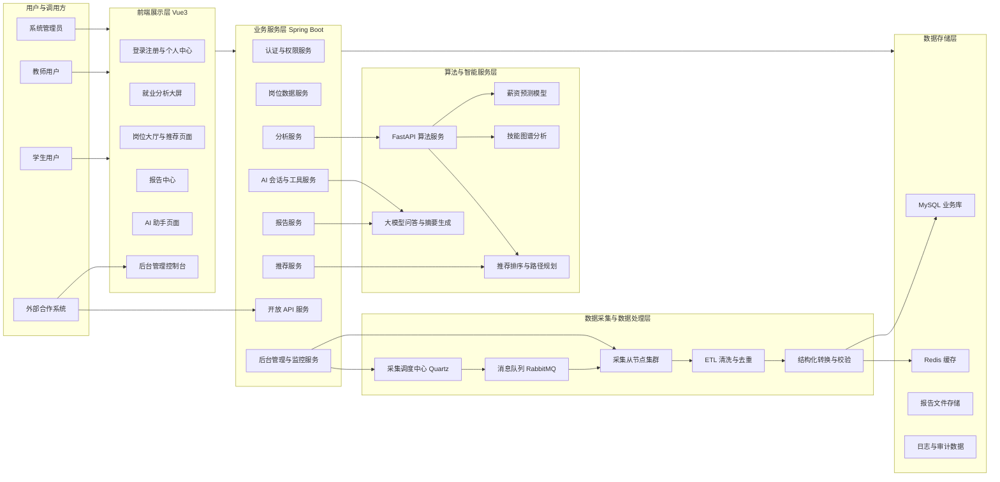

### 1.2 平台功能模块箱型图

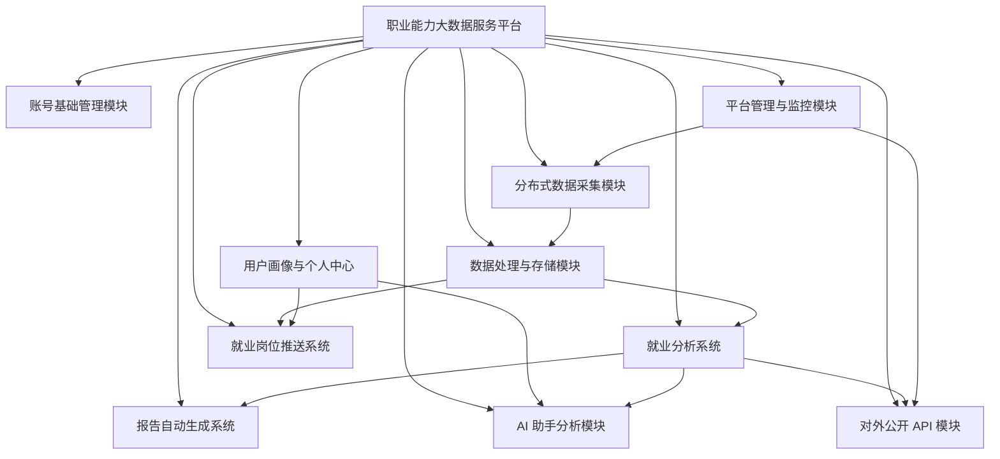

---

## 2. 分层架构图与逻辑视图

### 2.1 四层逻辑视图

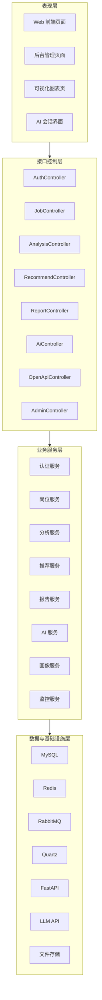

### 2.2 数据流转逻辑图

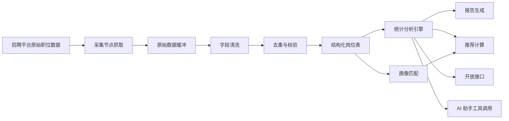

---

## 3. 部署视图

### 3.1 容器部署图

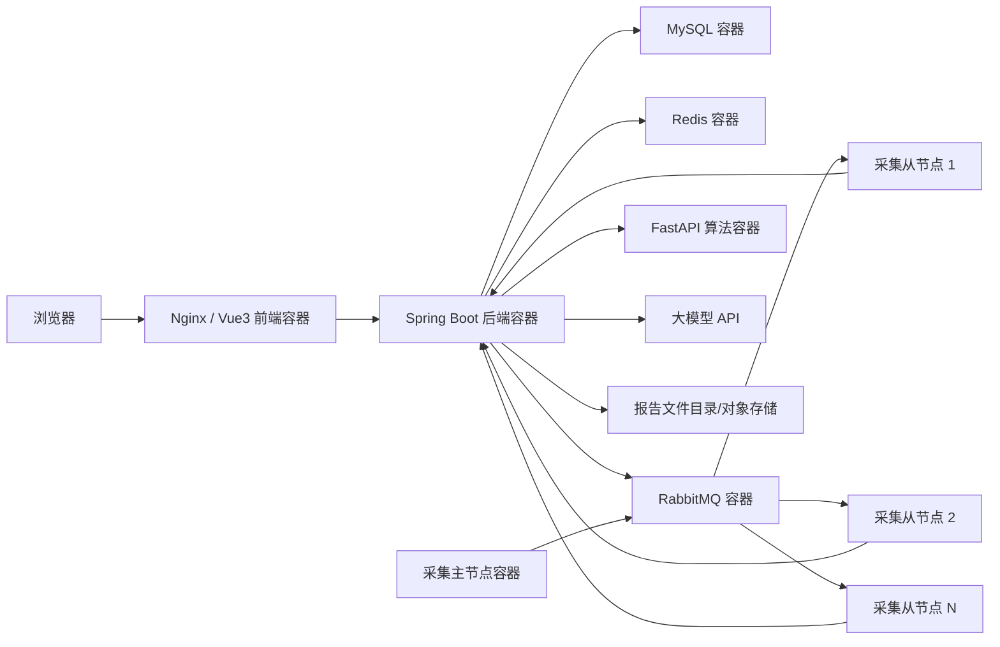

### 3.2 分布式采集部署图

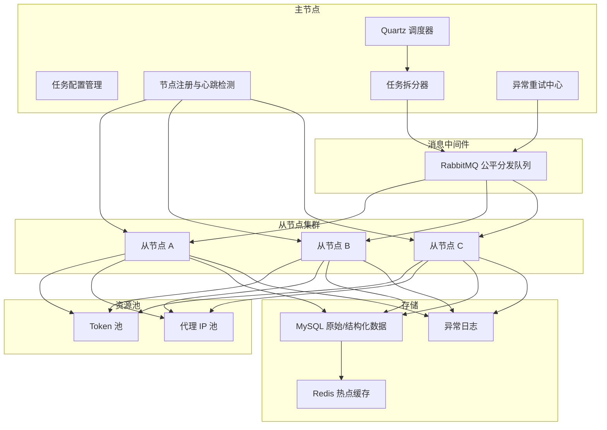

---

## 4. 关键用例图

### 4.1 平台总体用例图

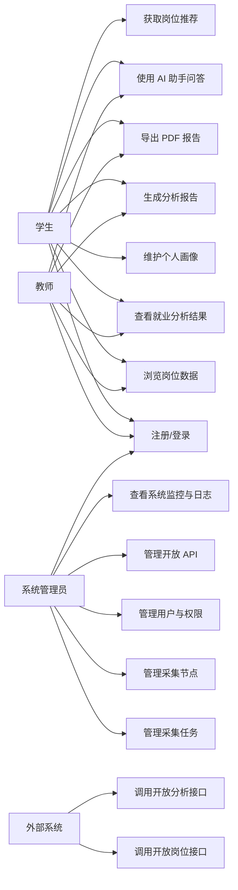

### 4.2 报告生成系统用例图

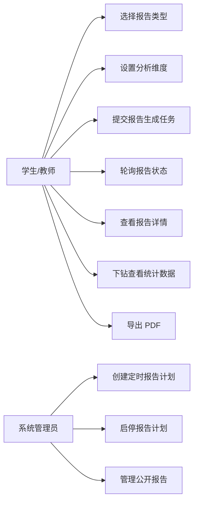

### 4.3 AI 助手模块用例图

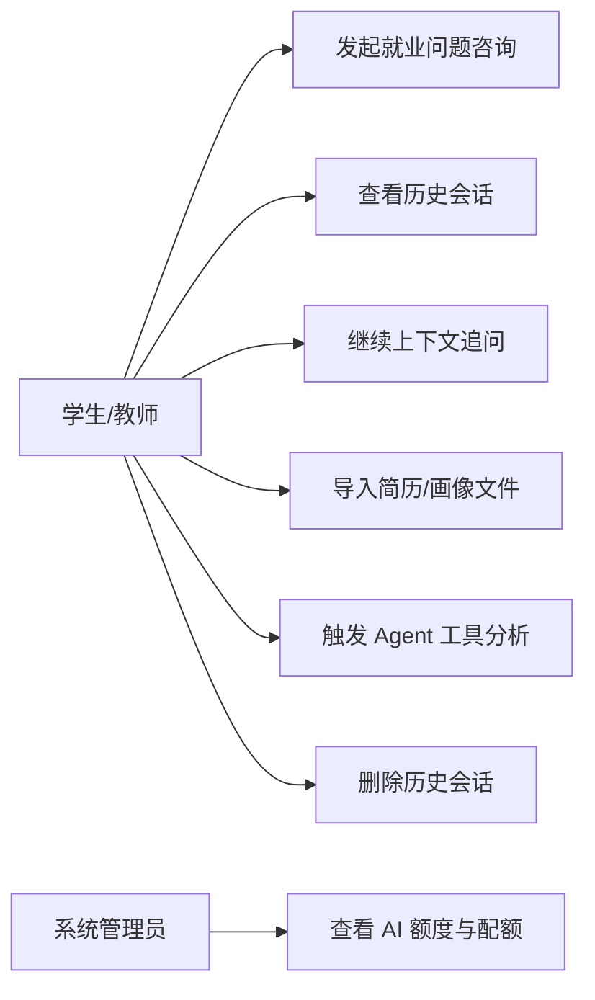

### 4.4 后台管理模块用例图

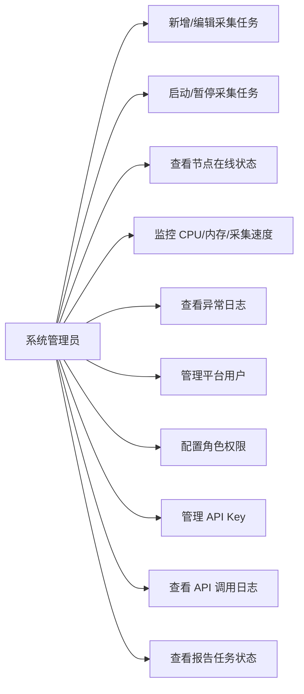

---

## 5. 活动图

### 5.1 用户登录活动图

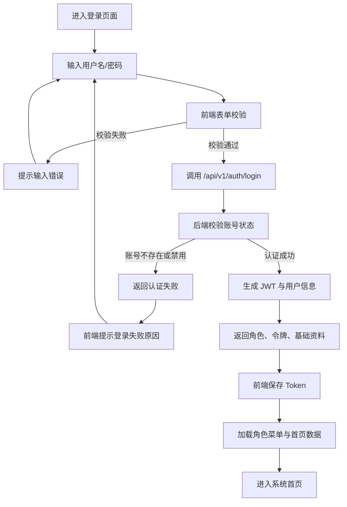

### 5.2 分布式采集活动图

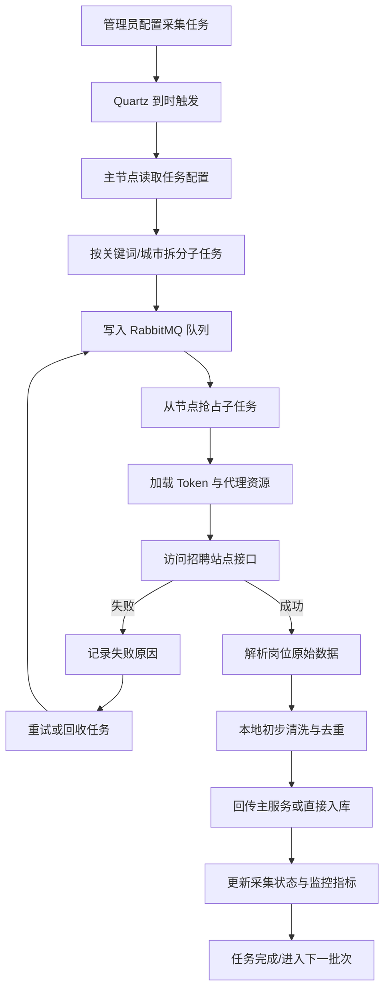

### 5.3 数据处理与入库活动图

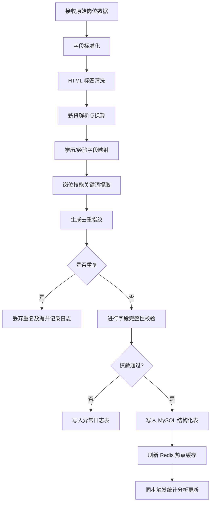

### 5.4 报告生成活动图

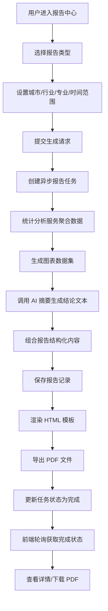

### 5.5 AI 助手问答活动图

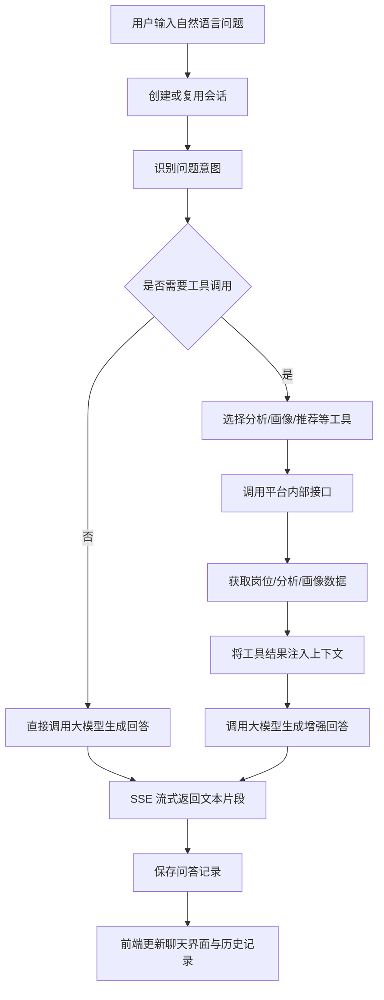

### 5.6 岗位推荐活动图

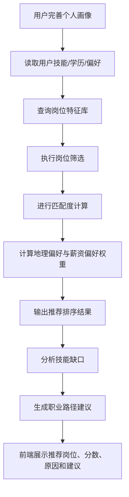

---

## 6. 流程图

### 6.1 报告自动生成系统流程图

```mermaid
flowchart LR
    A["接收生成请求"] --> B["校验用户权限与参数"]
    B --> C["创建任务记录"]
    C --> D["读取分析数据源"]
    D --> E["执行聚合统计"]
    E --> F["计算图表指标"]
    F --> G["生成文字结论"]
    G --> H["落库 biz_analysis_report"]
    H --> I["渲染报告模板"]
    I --> J["输出 PDF"]
    J --> K["更新任务状态"]
    K --> L["通知前端可下载"]
```

### 6.2 开放 API 调用流程图

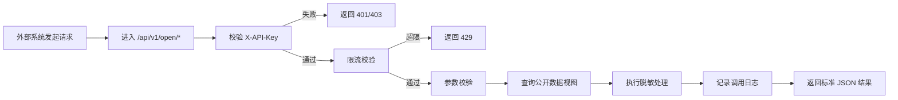

### 6.3 后台监控预警流程图

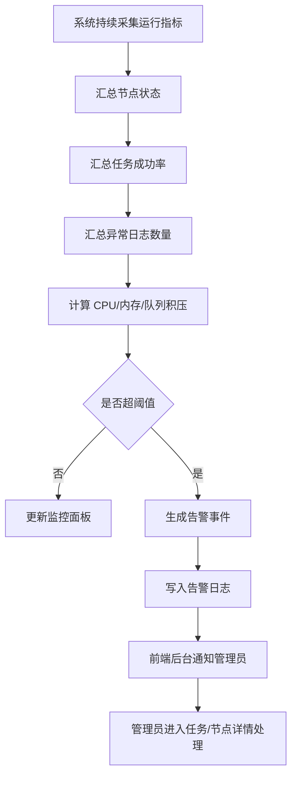

---

## 7. 时序图

### 7.1 用户登录时序图

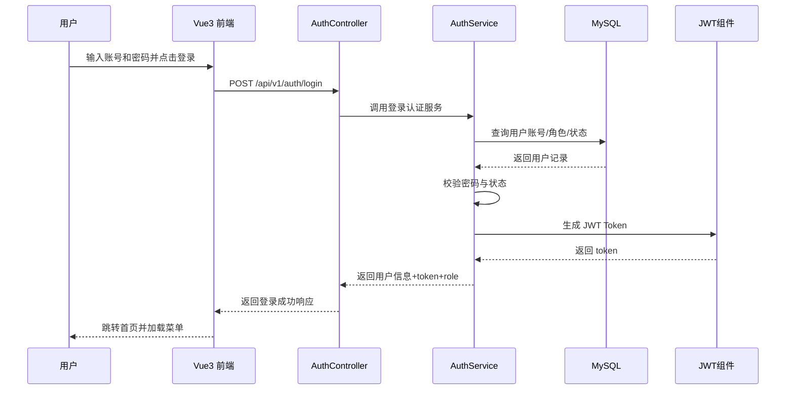

### 7.2 报告生成时序图

```mermaid
sequenceDiagram
    participant U as 用户
    participant V as 报告中心页面
    participant RC as ReportController
    participant RS as ReportService
    participant AS as AnalysisService
    participant AI as LLM Summary Service
    participant PDF as PdfExportService
    participant DB as MySQL

    U->>V: 提交报告生成参数
    V->>RC: POST /api/v1/reports/generate
    RC->>RS: 创建异步报告任务
    RS->>DB: 保存任务记录
    RS->>AS: 获取分析统计数据
    AS-->>RS: 返回图表与聚合结果
    RS->>AI: 生成摘要与结论文本
    AI-->>RS: 返回报告摘要
    RS->>DB: 保存报告内容
    RS->>PDF: 渲染并导出 PDF
    PDF-->>RS: 返回文件地址/流
    RS->>DB: 更新状态为 COMPLETED
    V->>RC: GET /api/v1/reports/{taskId}/status
    RC-->>V: 返回完成状态与 reportId
    V-->>U: 展示报告详情/下载入口
```

### 7.3 AI 助手问答时序图

```mermaid
sequenceDiagram
    participant U as 用户
    participant V as AI 页面
    participant AC as AiController
    participant AS as AiService
    participant Tool as Agent Tool Router
    participant API as 平台内部接口
    participant LLM as 大模型服务
    participant DB as 会话存储

    U->>V: 输入问题
    V->>AC: POST /api/v1/ai/chat
    AC->>AS: 创建流式响应
    AS->>DB: 读取历史会话上下文
    AS->>Tool: 判断是否需要工具调用
    Tool->>API: 调用画像/分析/推荐接口
    API-->>Tool: 返回结构化数据
    Tool-->>AS: 返回工具结果
    AS->>LLM: 发送问题+上下文+工具结果
    LLM-->>AS: 流式返回回答片段
    AS-->>V: SSE message/done 事件
    AS->>DB: 保存本轮会话消息
    V-->>U: 实时展示回答内容
```

### 7.4 推荐计算时序图

```mermaid
sequenceDiagram
    participant U as 用户
    participant V as 推荐页面
    participant RC as RecommendController
    participant RS as RecommendService
    participant PS as ProfileService
    participant JS as JobService
    participant FS as FastAPI 算法服务
    participant DB as MySQL

    U->>V: 请求个性化推荐
    V->>RC: POST /api/v1/recommend/jobs
    RC->>RS: 执行推荐任务
    RS->>PS: 获取用户画像
    PS->>DB: 查询画像与技能标签
    DB-->>PS: 返回画像数据
    RS->>JS: 获取候选岗位集合
    JS->>DB: 查询岗位特征
    DB-->>JS: 返回候选岗位
    RS->>FS: 发送画像特征与岗位特征
    FS-->>RS: 返回匹配分和推荐原因
    RS-->>RC: 推荐结果列表
    RC-->>V: 返回推荐岗位、分数、技能缺口
    V-->>U: 渲染推荐页面
```

---

## 8. 各核心模块详细设计图

### 8.1 分布式数据采集模块箱型图

```mermaid
flowchart TB
    X["分布式数据采集模块"]
    X --> X1["采集任务配置子模块"]
    X --> X2["定时调度子模块"]
    X --> X3["任务拆分与分发子模块"]
    X --> X4["从节点执行子模块"]
    X --> X5["反爬资源管理子模块"]
    X --> X6["节点监控子模块"]
    X --> X7["异常重试子模块"]

    X5 --> X51["Token 池"]
    X5 --> X52["代理 IP 池"]
    X6 --> X61["心跳检测"]
    X6 --> X62["CPU/内存采集"]
    X7 --> X71["失败重试"]
    X7 --> X72["任务回收重分配"]
```

### 8.2 数据处理与存储模块箱型图

```mermaid
flowchart TB
    Y["数据处理与存储模块"]
    Y --> Y1["原始数据接收"]
    Y --> Y2["清洗规则处理"]
    Y --> Y3["去重与指纹识别"]
    Y --> Y4["字段校验"]
    Y --> Y5["结构化入库"]
    Y --> Y6["热点缓存更新"]
    Y --> Y7["异常日志管理"]

    Y5 --> Y51["岗位表"]
    Y5 --> Y52["分析报告表"]
    Y5 --> Y53["用户画像表"]
    Y5 --> Y54["会话记录表"]
```

### 8.3 报告分析系统箱型图

```mermaid
flowchart TB
    R["报告分析系统"]
    R --> R1["岗位数量分析"]
    R --> R2["城市热度分析"]
    R --> R3["行业分布分析"]
    R --> R4["薪资区间分析"]
    R --> R5["技能需求分析"]
    R --> R6["供需趋势分析"]
    R --> R7["教学改革支撑分析"]
```

### 8.4 报告自动生成系统箱型图

```mermaid
flowchart TB
    G["报告自动生成系统"]
    G --> G1["任务创建"]
    G --> G2["任务状态管理"]
    G --> G3["数据聚合"]
    G --> G4["AI 摘要生成"]
    G --> G5["模板渲染"]
    G --> G6["PDF 导出"]
    G --> G7["定时计划管理"]
    G --> G8["公开报告管理"]
```

### 8.5 就业岗位推送系统箱型图

```mermaid
flowchart TB
    T["就业岗位推送系统"]
    T --> T1["用户画像特征提取"]
    T --> T2["候选岗位筛选"]
    T --> T3["相似度计算"]
    T --> T4["推荐排序"]
    T --> T5["技能缺口分析"]
    T --> T6["职业路径规划"]
    T --> T7["推荐原因生成"]
```

### 8.6 AI 助手分析模块箱型图

```mermaid
flowchart TB
    A["AI 助手分析模块"]
    A --> A1["会话管理"]
    A --> A2["Prompt 组装"]
    A --> A3["工具路由"]
    A --> A4["平台数据增强"]
    A --> A5["大模型调用"]
    A --> A6["SSE 流式输出"]
    A --> A7["历史记录归档"]
    A --> A8["文件导入画像提取"]
```

### 8.7 开放 API 模块箱型图

```mermaid
flowchart TB
    O["开放 API 模块"]
    O --> O1["API Key 鉴权"]
    O --> O2["请求参数校验"]
    O --> O3["限流控制"]
    O --> O4["公开岗位接口"]
    O --> O5["公开分析接口"]
    O --> O6["公开报告接口"]
    O --> O7["数据脱敏处理"]
    O --> O8["调用日志记录"]
```

### 8.8 平台管理与监控模块箱型图

```mermaid
flowchart TB
    M["平台管理与监控模块"]
    M --> M1["用户与角色管理"]
    M --> M2["采集任务管理"]
    M --> M3["节点管理"]
    M --> M4["监控大屏"]
    M --> M5["异常预警"]
    M --> M6["报告任务管理"]
    M --> M7["API 调用日志管理"]
    M --> M8["系统审计日志管理"]
```

---

## 9. 数据库关系图参考

### 9.1 核心业务数据关系图

```mermaid
erDiagram
    SYS_USER ||--o{ USER_PROFILE : has
    SYS_USER ||--o{ AI_CONVERSATION : owns
    AI_CONVERSATION ||--o{ AI_MESSAGE : contains
    SYS_USER ||--o{ ANALYSIS_REPORT : creates
    SYS_USER ||--o{ RECOMMEND_RESULT : receives
    JOB_INFO ||--o{ RECOMMEND_RESULT : referenced_by
    CRAWL_TASK ||--o{ CRAWL_TASK_LOG : generates
    CRAWL_NODE ||--o{ CRAWL_TASK_LOG : executes
    API_CLIENT ||--o{ API_CALL_LOG : invokes

    SYS_USER {
        bigint id
        string username
        string password_hash
        string role
        string status
    }
    USER_PROFILE {
        bigint id
        bigint user_id
        string education
        string target_job
        string city_preference
    }
    JOB_INFO {
        bigint id
        string job_title
        string company_name
        string city
        string salary_range
    }
    ANALYSIS_REPORT {
        bigint id
        bigint user_id
        string report_type
        string status
        datetime created_at
    }
```

---

## 10. 接口分组关系图

### 10.1 接口设计总图

```mermaid
flowchart TB
    API["统一接口前缀 /api/v1"]
    API --> A["/auth"]
    API --> B["/profile"]
    API --> C["/analysis"]
    API --> D["/jobs"]
    API --> E["/recommend"]
    API --> F["/ai"]
    API --> G["/reports"]
    API --> H["/open"]
    API --> I["/admin"]

    A --> A1["登录/注册/刷新/个人资料"]
    B --> B1["画像维护/技能维护"]
    C --> C1["概览/趋势/预测/热力图/深度分析"]
    D --> D1["列表/详情/统计/搜索"]
    E --> E1["岗位推荐/技能建议/职业路径"]
    F --> F1["聊天/Agent/会话/文件导入"]
    G --> G1["生成/状态/下钻/PDF/计划任务"]
    H --> H1["公开岗位/公开分析/公开报告"]
    I --> I1["用户/任务/节点/API/日志/监控"]
```

---

## 11. 可直接放入“详细设计”章节的小图建议

### 11.1 报告中心页面组件关系图

```mermaid
flowchart LR
    P["报告中心页面"] --> P1["报告筛选栏"]
    P["报告中心页面"] --> P2["报告列表"]
    P["报告中心页面"] --> P3["任务状态面板"]
    P["报告中心页面"] --> P4["报告详情弹层"]
    P["报告中心页面"] --> P5["PDF 导出按钮"]
    P["报告中心页面"] --> P6["定时计划管理区"]
```

### 11.2 AI 页面组件关系图

```mermaid
flowchart LR
    A["AI 助手页面"] --> A1["历史会话列表"]
    A["AI 助手页面"] --> A2["当前会话消息区"]
    A["AI 助手页面"] --> A3["问题输入框"]
    A["AI 助手页面"] --> A4["文件导入区"]
    A["AI 助手页面"] --> A5["配额信息区"]
    A2 --> A21["用户消息"]
    A2 --> A22["AI 回答消息"]
    A2 --> A23["工具调用结果折叠区"]
```

---

## 12. 建议你在 Word 中如何对应放图

### 第 2 章 架构设计

- 放 `1.1 平台总体架构图`
- 放 `1.2 平台功能模块箱型图`
- 放 `2.1 四层逻辑视图`
- 放 `3.1 容器部署图`

### 第 5 章 关键用例视图

- 放 `4.1 平台总体用例图`
- 放 `4.2 报告生成系统用例图`
- 放 `4.3 AI 助手模块用例图`
- 放 `4.4 后台管理模块用例图`

### 第 7 章 逻辑视图

- 放 `2.1 四层逻辑视图`
- 放 `2.2 数据流转逻辑图`

### 第 8 章 部署视图

- 放 `3.1 容器部署图`
- 放 `3.2 分布式采集部署图`

### 第 9 章 接口设计

- 放 `10.1 接口设计总图`
- 放 `6.2 开放 API 调用流程图`

### 第 12 章 详细设计

- 登录模块：`5.1 用户登录活动图`、`7.1 用户登录时序图`
- 采集模块：`5.2 分布式采集活动图`、`8.1 分布式数据采集模块箱型图`
- 数据处理模块：`5.3 数据处理与入库活动图`、`8.2 数据处理与存储模块箱型图`
- 报告模块：`5.4 报告生成活动图`、`7.2 报告生成时序图`、`8.4 报告自动生成系统箱型图`
- 推荐模块：`5.6 岗位推荐活动图`、`7.4 推荐计算时序图`、`8.5 就业岗位推送系统箱型图`
- AI 模块：`5.5 AI 助手问答活动图`、`7.3 AI 助手问答时序图`、`8.6 AI 助手分析模块箱型图`
- 管理模块：`6.3 后台监控预警流程图`、`8.8 平台管理与监控模块箱型图`

