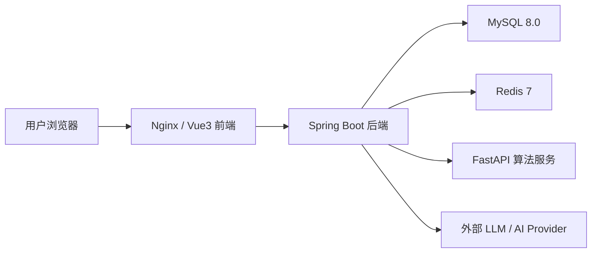
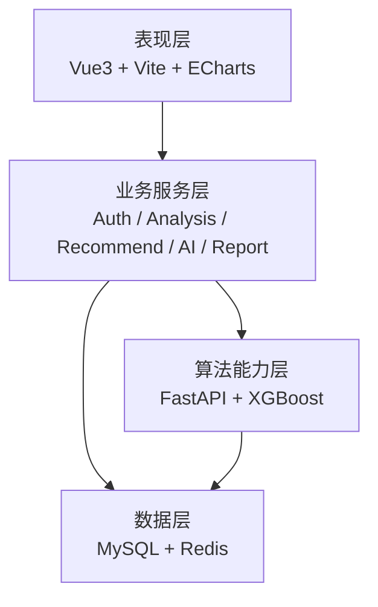
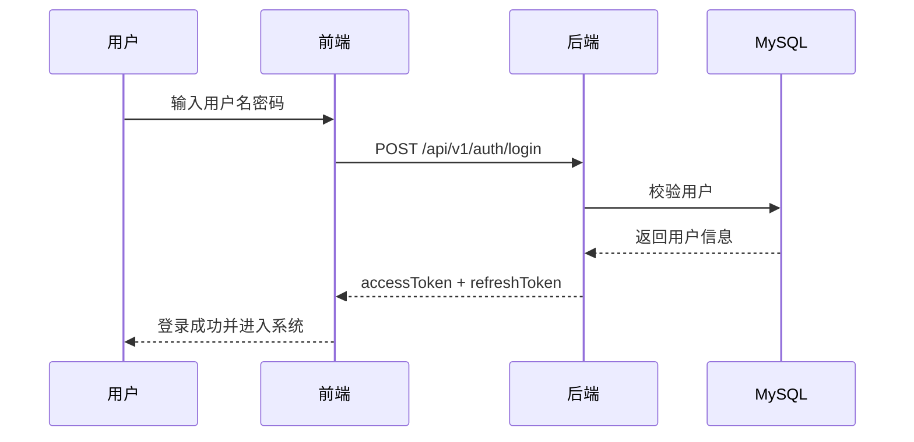
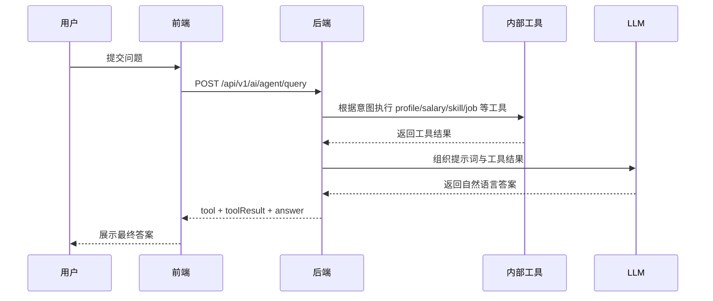
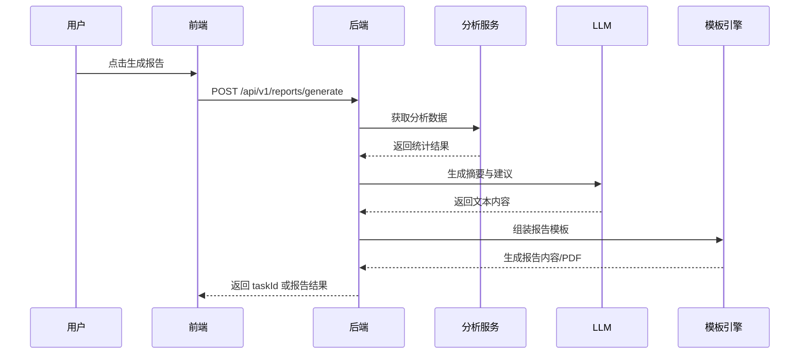
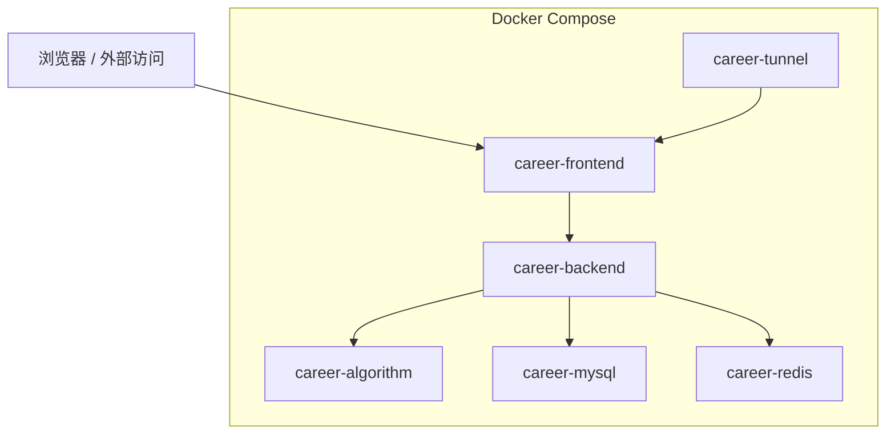
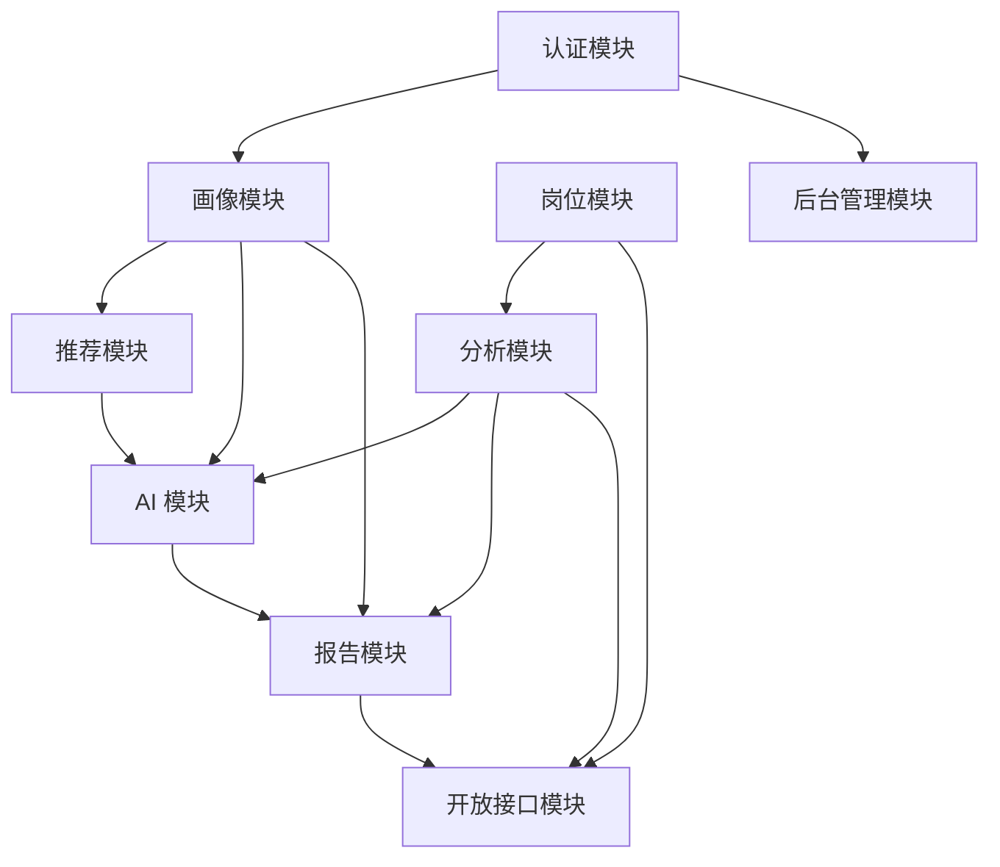

# 职业能力大数据服务平台

**系统架构与详细设计说明书**

版本号：`V1.1`

编写日期：`2026-04-15`

---

## 目录

1. 简介
1.1 目的
1.2 范围
1.3 定义、首字母缩写词和缩略语
1.4 参考资料
1.5 概述
2. 架构设计
2.1 数据处理架构设计
2.2 数据分析和挖掘架构设计
2.3 数据安全架构设计
3. 构架表示方式
4. 构架目标和约束
5. 关键用例视图
5.1 用户认证与权限管理
5.2 岗位数据分析与可视化
5.3 智能推荐与职业规划
5.4 AI 助手与 Agent 工具调用
5.5 报告生成与导出
5.6 平台管理与开放接口
6. 层次结构
7. 逻辑视图
7.1 概述
7.2 前端表现层
7.3 业务服务层
7.4 数据服务层
8. 部署视图
9. 接口设计
10. 系统的组织结构
11. 界面设计要求
12. 详细设计
12.1 系统模块划分
12.2 模块详细设计
12.3 接口设计
12.4 算法与模型设计
12.5 系统部署与运维设计
12.6 登录注册界面设计说明
12.7 数据分析与岗位洞察设计说明
12.8 AI 助手与报告中心设计说明
12.9 个人画像与推荐功能设计说明
13. 模块相互关系表
14. 附录：Mermaid 图代码

---

## 1. 简介

本文档用于系统性描述“职业能力大数据服务平台”的软件架构设计、模块职责划分、接口规范、算法调用关系、部署方式与关键界面设计说明。本文档既面向开发与联调，也面向后续运维、功能扩展和答辩汇报使用。

### 1.1 目的

本文档的具体目的如下：

- 明确系统的分层架构、模块边界和组件职责。
- 为前端、后端、算法、测试和运维团队提供统一设计依据。
- 固化已稳定的接口契约，降低联调成本。
- 支撑毕业设计、项目交付、项目评审场景下的材料输出。

### 1.2 范围

本文档覆盖以下设计内容：

- Vue 3 前端单页应用总体设计
- Spring Boot 后端服务总体设计
- Python FastAPI 算法服务设计
- MySQL 与 Redis 数据设计
- Docker Compose 容器部署设计
- AI 聊天、Agent、推荐、报告、平台分析、开放接口、后台管理等核心模块设计

本文档不覆盖：

- 第三方招聘网站的采集策略细节
- 外部大模型服务商内部实现机制
- 云平台底层网络与主机层面的详细实现

### 1.3 定义、首字母缩写词和缩略语

| 术语 | 说明 |
|------|------|
| SPA | 单页应用 |
| JWT | 登录认证令牌 |
| RBAC | 基于角色的权限控制 |
| SSE | 服务端事件流 |
| API | 应用程序接口 |
| ETL | 数据抽取、转换、装载 |
| Agent | 带工具调用能力的智能代理模式 |
| LLM | 大语言模型 |
| OpenAPI | 对外开放接口体系 |

### 1.4 参考资料

- 项目需求说明
- `README.md`
- `SETUP.md`
- `API_HANDOFF.md`
- 后端源码、前端源码、数据库初始化脚本

### 1.5 概述

职业能力大数据服务平台以招聘岗位数据为核心数据源，构建面向求职者、管理者和对外开放场景的一体化平台。系统支持以下业务能力：

- 岗位数据查询、筛选和详情查看
- 平台级岗位统计分析与可视化
- 技能热度分析、薪资趋势分析、区域热力分析
- 基于用户画像的岗位推荐、技能推荐和职业路径规划
- 内置 AI 助手与 Agent 工具化问答
- 个性化职业报告生成、查询与 PDF 导出
- 后台管理、开放接口、订阅通知、知识图谱扩展能力

系统采用“前后端分离 + 算法服务独立部署 + 数据与缓存解耦 + 外部 AI 服务增强”的整体架构。

---

## 2. 架构设计

### 2.1 数据处理架构设计

#### 2.1.1 简介

数据处理架构承担岗位数据导入、字段标准化、统计口径统一、缓存输出与分析消费等职责。设计目标是将原始招聘数据沉淀为可查询、可分析、可推荐、可报告的统一数据资产。

#### 2.1.2 数据来源与技术选择

- 原始数据来源：招聘岗位 JSON 数据、标签字典数据、初始化账号与系统配置数据
- 核心数据库：MySQL 8.0
- 缓存与运行时数据：Redis 7
- 数据导入工具：Python 脚本 + SQL 初始化脚本
- 数据交换格式：JSON

#### 2.1.3 数据处理流程设计

数据处理流程如下：

1. 数据接收
   - 接收清洗后的岗位 JSON 文件。
   - 接收系统初始化 SQL 脚本。

2. 数据清洗
   - 对空值、异常薪资、重复岗位进行处理。
   - 对城市、行业、经验、学历等字段做标准化。

3. 数据转换
   - 岗位主表与技能关系表拆分存储。
   - 将面向前端展示的聚合维度转换为可直接查询的结构。

4. 数据入库
   - 岗位、技能、用户、报告、任务、订阅等数据写入 MySQL。
   - 配额计数、统计缓存写入 Redis。

5. 数据服务输出
   - 提供给分析模块、推荐模块、AI 模块、报告模块使用。

#### 2.1.4 数据处理优化策略

- 聚合计算尽量下沉到 SQL 层执行。
- 高频分析结果缓存于 Redis。
- 使用统一的时间格式和分页格式，减少前端二次处理成本。
- 对报告生成与预测计算采用异步/分离式调用，避免阻塞主链路。

### 2.2 数据分析和挖掘架构设计

#### 2.2.1 简介

数据分析与挖掘架构用于支撑岗位统计、技能分析、薪资预测、供需分析、知识图谱和个性化推荐等能力。

#### 2.2.2 技术选型

- Spring Boot：承担主要业务分析接口与组织逻辑
- FastAPI：承担算法模型接口与部分分析能力
- XGBoost：承担薪资预测
- ECharts：承担前端可视化表达
- 外部 LLM 服务：承担自然语言生成、问答和报告增强能力

#### 2.2.3 分析数据预处理

- 时间维度：按月对岗位发布时间聚合
- 空间维度：按城市、区域输出热度分析
- 结构维度：按学历、经验、行业分类聚合
- 技能维度：构造热门技能和共现技能图谱
- 用户维度：将画像与市场数据融合为推荐输入

#### 2.2.4 分析模型设计

- 薪资预测模型
  - 输入：城市、经验、学历、技能
  - 输出：预估薪资范围与解释字段

- 技能图谱模型
  - 输入：岗位与技能关系
  - 输出：技能热度、技能关联边

- 推荐规则模型
  - 输入：用户画像、岗位统计、技能差距
  - 输出：岗位推荐、技能推荐、职业路径建议

- 报告生成模型
  - 输入：市场概览、趋势、热度、用户画像、建议项
  - 输出：结构化报告和自然语言摘要

### 2.3 数据安全架构设计

安全设计从认证、授权、配置、接口保护和运行环境隔离五个方面展开：

- 认证：采用 JWT AccessToken + RefreshToken
- 授权：使用 Spring Security 与角色控制
- 接口保护：按匿名、登录用户、管理员划分访问权限
- 配额保护：AI 接口按用户每日配额限制
- 配置隔离：数据库密码、JWT Secret、AI Key 通过环境变量注入
- 环境隔离：容器内部通过服务名通信，对外只暴露必要端口

---

## 3. 构架表示方式

本系统采用以下方式描述架构：

- 用例视图：说明系统为谁服务、提供哪些关键能力
- 逻辑视图：说明前端、后端、算法、数据库之间的协作关系
- 开发视图：说明代码目录和模块划分
- 运行视图：说明请求在系统中的流转路径
- 部署视图：说明 Docker 环境中的容器部署方式

系统整体上属于“分层业务架构 + 服务协作架构 + 数据分析平台架构”的组合方案。

---

## 4. 构架目标和约束

### 4.1 构架目标

- 功能完整：覆盖用户、岗位、分析、推荐、AI、报告、管理多个业务域
- 接口稳定：便于前后端并行开发和交付
- 易于部署：支持本地一键部署和容器统一运行
- 可扩展：后续可接入更多模型、更多分析数据、更多开放能力

### 4.2 构架约束

- 后端框架固定为 Spring Boot 2.7 + Java 8
- 前端框架固定为 Vue 3 + Vite
- 算法服务采用 Python FastAPI
- 数据层固定为 MySQL + Redis
- 当前 PDF 导出依赖 HTML 模板渲染
- 外部 AI 服务存在网络延迟与服务稳定性约束

---

## 5. 关键用例视图

### 5.1 用户认证与权限管理

用例说明：

- 用户注册账号
- 用户登录平台
- 用户查询和修改自己的基本资料
- 用户修改密码
- 管理员查看用户列表并调整用户状态或角色

前置条件：

- 系统已初始化基础用户表和角色权限规则

后置结果：

- 登录成功后返回 AccessToken
- 用户操作被权限规则正确保护

### 5.2 岗位数据分析与可视化

用例说明：

- 用户查看概览统计
- 用户按维度查看岗位分布
- 用户查看薪资趋势和技能热度
- 用户查看区域热力分布
- 用户查看岗位详情和热门岗位

核心输出：

- 图表数据
- 聚合统计结果
- 可下钻的岗位明细

### 5.3 智能推荐与职业规划

用例说明：

- 用户根据自身画像获取岗位推荐
- 用户查看技能差距和补足建议
- 用户获取职业路径规划建议
- 用户获取简历评估和技能雷达分析
- 用户获取平台综合行动计划

### 5.4 AI 助手与 Agent 工具调用

用例说明：

- 用户发起自然语言问题
- AI 助手根据上下文给出流式回复
- Agent 自动选择工具并返回基于平台数据的回答
- 用户上传简历或其他文件，系统自动提取画像

### 5.5 报告生成与导出

用例说明：

- 用户生成职业分析报告
- 用户轮询查询报告生成状态
- 用户查看历史报告
- 用户查看报告下钻详情
- 用户导出 PDF 报告

### 5.6 平台管理与开放接口

用例说明：

- 管理员查看平台概览和日志
- 管理员管理数据源和采集任务
- 外部系统调用公开分析与岗位接口
- 外部系统配置 API Key

---

## 6. 层次结构

系统分为五个层次：

1. 客户端访问层
   - 浏览器
   - Nginx

2. 表现层
   - Vue 3 页面
   - ECharts 图表
   - 表单、表格、对话、报告展示

3. 业务服务层
   - Spring Boot 控制器和服务
   - 安全、认证、推荐、报告、AI、管理等业务逻辑

4. 算法能力层
   - FastAPI 算法服务
   - 预测、分析和图谱能力

5. 数据支撑层
   - MySQL
   - Redis
   - 外部 AI Provider

---

## 7. 逻辑视图

### 7.1 概述

平台采用前后端分离设计。前端负责交互和可视化，后端负责业务组织和数据聚合，算法服务负责模型计算，数据库负责持久化，Redis 负责缓存与运行时状态，外部 AI 服务负责自然语言能力增强。

### 7.2 前端表现层

前端主要职责：

- 提供用户界面和路由系统
- 调用统一 API 封装
- 展示岗位、分析、推荐、AI、报告等页面
- 保存登录态和主题配置

主要页面：

- 首页概览
- 岗位大厅
- 数据洞察
- AI 助手
- 推荐中心
- 报告中心
- 个人中心

### 7.3 业务服务层

后端按业务域拆分为多个控制器和服务：

- `AuthController`
- `ProfileController`
- `AnalysisController`
- `DeepAnalysisController`
- `JobController`
- `RecommendController`
- `AiController`
- `ReportController`
- `PlatformController`
- `AdminController`
- `OpenApiController`

业务服务层承担：

- 数据查询与聚合
- 安全认证与鉴权
- 业务规则编排
- AI 工具路由
- PDF 报告渲染
- 开放平台输出

### 7.4 数据服务层

数据服务层职责：

- MySQL 负责主业务数据存储
- Redis 负责缓存、限流、配额和热点统计
- 算法服务负责薪资预测与图谱计算
- 外部 LLM 负责问答和文本生成

---

## 8. 部署视图

当前系统通过 Docker Compose 部署，容器如下：

- `career-frontend`
- `career-backend`
- `career-algorithm`
- `career-mysql`
- `career-redis`
- `career-tunnel`

端口说明：

- 前端：`80`
- 后端：容器内 `8080`
- 算法服务：容器内 `8000`
- MySQL：宿主机 `3307 -> 3306`
- Redis：容器内部 `6379`

部署策略说明：

- 浏览器统一访问 `http://localhost`
- Nginx 将 `/api` 转发到后端
- 后端通过服务名 `mysql` 和 `redis` 访问依赖服务
- 后端通过服务名 `algorithm` 调用算法服务

---

## 9. 接口设计

### 9.1 统一设计规则

- 统一前缀：`/api/v1`
- 统一认证：`Authorization: Bearer <token>`
- 统一返回结构：

| 字段 | 说明 |
|------|------|
| `code` | 状态码 |
| `message` | 提示信息 |
| `data` | 主体数据 |
| `timestamp` | 返回时间 |
| `page/pageSize/total` | 分页接口附带字段 |

### 9.2 核心接口分组

| 模块 | 路径 | 说明 |
|------|------|------|
| 认证 | `/auth` | 登录注册、刷新、个人资料 |
| 画像 | `/profile` | 职业画像与技能维护 |
| 分析 | `/analysis` | 概览、趋势、预测、热力图 |
| 岗位 | `/jobs` | 列表、详情、聚合 |
| 推荐 | `/recommend` | 岗位、技能、职业路径、计划 |
| AI | `/ai` | 聊天、Agent、文件导入、会话 |
| 报告 | `/reports` | 生成、状态、下钻、PDF |
| 平台建议 | `/platform` | 综合建议 |
| 开放接口 | `/open` | 对外 API |
| 管理 | `/admin` | 后台管理 |

### 9.3 AI 接口设计要点

- `/ai/chat`
  - 使用 SSE 输出流式消息
  - 支持 `session`、`message`、`done`、`error` 事件

- `/ai/agent/query`
  - 输入自然语言问题与可选工具名
  - 输出工具名、工具结果和用户可读回答

- `/ai/agent/import-profile`
  - 支持文件上传
  - 自动抽取用户画像和技能信息

---

## 10. 系统的组织结构

### 10.1 代码组织结构

- `frontend/`
  - `src/views`
  - `src/router`
  - `src/api.js`
  - `src/components`

- `backend/`
  - `controller`
  - `service`
  - `mapper`
  - `entity`
  - `config`
  - `resources/templates`

- `algorithm/`
  - `app/main.py`
  - `predictor`
  - `skill_graph`

- `config/`
  - `init.sql`
  - Nginx 配置

### 10.2 团队协作结构

- 前端开发负责页面、状态、路由、交互
- 后端开发负责接口、权限、数据组织
- 算法开发负责模型、预测与分析接口
- 运维负责 Docker、环境、发布和日志排查

---

## 11. 界面设计要求

### 11.1 总体要求

- 首页要体现平台感和数据感
- 分析页要突出图表表达能力
- AI 页要突出输入、输出、上下文状态
- 报告页要突出结果结构化展示和导出闭环
- 推荐页要突出个性化建议和行动路径

### 11.2 可用性要求

- 所有关键按钮需有明确反馈
- 403、500、空数据状态必须显式展示
- 表单项需有输入校验提示
- PDF 导出失败要明确说明原因

### 11.3 一致性要求

- 使用统一的色彩、字号、间距和交互模式
- 列表页与详情页跳转路径保持统一
- 个人画像修改后要及时回显到推荐、AI、报告模块

---

## 12. 详细设计

### 12.1 系统模块划分

系统划分为以下模块：

- 用户与认证模块
- 用户画像模块
- 岗位数据模块
- 数据分析模块
- 推荐模块
- AI 助手模块
- 报告模块
- 开放平台模块
- 后台管理模块
- 订阅与通知模块
- 知识图谱与深度分析模块

### 12.2 模块详细设计

#### 12.2.1 用户与认证模块

职责：

- 处理注册、登录、刷新令牌、修改密码
- 返回当前登录用户信息
- 维护用户状态与角色信息

关键实现点：

- 使用 JWT 保存登录态
- 使用 Spring Security 统一保护接口
- 登录成功后返回用户基础信息与过期时间

#### 12.2.2 用户画像模块

职责：

- 保存用户教育背景、目标岗位、城市偏好、技能列表
- 向推荐、AI、报告模块提供画像数据

关键实现点：

- 首次使用时自动补建画像
- 支持 AI 文件导入画像
- 技能字段采用 JSON 结构存储

#### 12.2.3 岗位数据模块

职责：

- 支持岗位列表查询、条件过滤、详情查看、热门岗位输出
- 提供按城市、行业、学历、经验的统计接口

关键实现点：

- 使用聚合 SQL 直接输出前端可消费数据
- 为开放接口提供匿名访问能力

#### 12.2.4 数据分析模块

职责：

- 输出概览数据
- 输出薪资趋势数据
- 输出技能热度与技能图谱数据
- 输出区域热力图数据
- 输出薪资预测结果

关键实现点：

- 聚合结果优先缓存
- 算法型接口通过算法服务调用
- 图表数据结构尽量扁平化，降低前端转换复杂度

#### 12.2.5 推荐模块

职责：

- 生成岗位推荐
- 生成技能推荐
- 生成职业路径建议
- 生成简历评估与行动计划

关键实现点：

- 基于用户画像和市场热度做融合计算
- 推荐结果包含推荐原因、技能差距、下一步建议
- 计划页输出综合建议、风险与快速入口

#### 12.2.6 AI 助手模块

职责：

- SSE 流式聊天
- Agent 工具化回答
- 文件导入画像
- 会话列表与会话详情
- 日调用配额管理

关键实现点：

- 聊天模块支持上下文历史
- Agent 根据问题意图自动选择工具：
  - `profile_snapshot`
  - `salary_insight`
  - `skill_gap`
  - `job_match`
  - `career_path`
- 返回结果统一做回答清洗，避免内部推理直接暴露

#### 12.2.7 报告模块

职责：

- 生成报告任务
- 查询生成状态
- 查询报告列表
- 查看报告下钻详情
- 导出 PDF
- 管理调度计划

关键实现点：

- 报告内容由数据分析结果和 AI 文本摘要组成
- 使用 Thymeleaf 模板渲染 PDF
- 报告支持 JSON 结构存储和 PDF 可视导出

#### 12.2.8 开放平台模块

职责：

- 对外开放岗位与分析接口
- 支持管理 API Key
- 支持公开报告读取

关键实现点：

- 只开放经授权或匿名允许的接口
- API Key 仅允许管理员管理

#### 12.2.9 后台管理模块

职责：

- 查看平台概览
- 用户管理
- 角色状态管理
- 日志查看
- 数据源和采集任务管理

### 12.3 接口设计

#### 12.3.1 前后端接口

交互方式：

- HTTP + JSON
- Token 鉴权
- 标准状态码和统一响应结构

典型流程：

1. 前端登录获取 Token
2. 前端带 Token 请求分析、推荐、AI、报告等接口
3. 后端返回结构化数据
4. 前端进行页面展示和图表渲染

#### 12.3.2 后端与算法服务接口

接口职责：

- 提供薪资预测
- 提供技能图谱或分析结果
- 提供趋势相关模型计算

调用特点：

- 通过 HTTP 调用
- 入参结构化
- 返回面向业务封装的结果

#### 12.3.3 后端与外部 AI 服务接口

接口职责：

- 流式聊天
- 非流式生成
- 报告文本增强
- Agent 文本输出

风险控制：

- 提供本地兜底内容
- 对返回文本做清洗
- 使用配额限制控制调用量

### 12.4 算法与模型设计

#### 12.4.1 薪资预测模型

输入特征：

- 城市
- 学历
- 工作经验
- 技能标签

输出结果：

- 预测薪资下限
- 预测薪资上限
- 参考区间

#### 12.4.2 技能图谱模型

输入：

- 岗位标签与技能关系

输出：

- 热门技能列表
- 技能共现节点与边

#### 12.4.3 推荐推理模型

输入：

- 用户画像
- 热门岗位
- 热门技能
- 缺口技能

输出：

- 推荐岗位列表
- 推荐技能列表
- 路径规划建议
- 行动计划

### 12.5 系统部署与运维设计

#### 12.5.1 部署方式

- 本地开发部署
- Docker Compose 一键部署
- 可选 Cloudflare Tunnel 公网穿透

#### 12.5.2 运维操作

- 查看容器状态：`docker compose ps`
- 查看后端日志：`docker compose logs backend`
- 重建后端：`docker compose build backend`
- 强制重建容器：`docker compose up -d --force-recreate backend`

#### 12.5.3 故障处理要点

- 403：优先检查 JWT 和角色权限
- 500：优先检查数据库、Redis、AI 服务与算法服务状态
- 502：优先检查 Nginx 反向代理后端容器是否 ready
- AI 空响应：优先检查外部 AI 配置和清洗兜底逻辑

### 12.6 登录注册界面设计说明

登录注册页包含：

- 用户名输入框
- 密码输入框
- 注册信息表单
- 登录/注册切换入口
- 错误提示区

交互要求：

- 输入合法性校验
- 登录成功后写入本地 Token
- 注册成功支持自动跳转登录

### 12.7 数据分析与岗位洞察设计说明

页面设计包括：

- 概览卡片区
- 薪资趋势图
- 热门城市图
- 热门行业图
- 技能热度图
- 岗位列表和详情下钻

交互要求：

- 支持按时间、城市、行业筛选
- 支持图表联动
- 支持从统计图进入岗位明细

### 12.8 AI 助手与报告中心设计说明

AI 页要求：

- 清晰输入区和消息流展示区
- 支持普通聊天和 Agent 模式
- 支持展示工具执行结果摘要
- 支持历史会话切换

报告页要求：

- 支持生成按钮、状态轮询、列表展示
- 支持详情钻取与 PDF 导出
- 支持失败状态提示与重试

### 12.9 个人画像与推荐功能设计说明

页面设计包括：

- 个人画像编辑表单
- 技能维护区
- 推荐结果卡片列表
- 行动建议列表
- 综合风险与改进项提示

交互要求：

- 画像修改后联动推荐和 AI 能力
- 推荐结果可解释
- 行动建议可直接跳转到对应功能模块

---

## 13. 模块相互关系表

| 模块 | 主要依赖 | 输出对象 | 说明 |
|------|----------|----------|------|
| 用户与认证 | Redis、Spring Security | 登录态、用户基础信息 | 所有受保护模块入口 |
| 用户画像 | MySQL | 画像上下文 | 推荐、AI、报告输入基础 |
| 岗位数据 | MySQL | 列表、详情、统计源数据 | 分析与推荐底座 |
| 数据分析 | 岗位数据、算法服务、Redis | 图表数据、预测结果 | 支撑首页和报告 |
| 推荐 | 画像、岗位、分析 | 推荐结果、行动项 | 个性化能力核心 |
| AI 助手 | 画像、分析、推荐、外部 AI | 问答结果、Agent 结果 | 智能交互核心 |
| 报告 | 分析、画像、AI、模板 | 报告列表、详情、PDF | 决策输出模块 |
| 开放平台 | 岗位、分析、报告 | 对外 API | 第三方调用能力 |
| 后台管理 | 用户、采集、日志 | 管理操作 | 运维和治理能力 |

---

## 14. 附录：Mermaid 图代码

### 14.1 系统总体架构图

### 14.2 核心业务分层图

### 14.3 用户登录与访问流程图

### 14.4 AI Agent 调用流程图

### 14.5 报告生成流程图

### 14.6 Docker 部署结构图

### 14.7 模块依赖关系图

